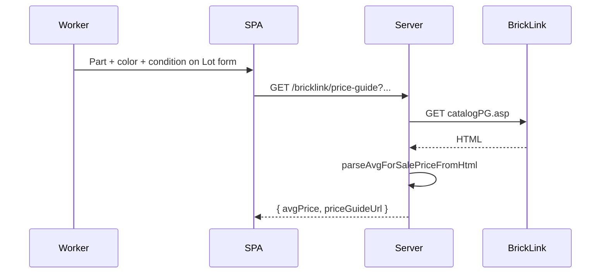

# BrickLink catalog price guide — `catalogPG.asp`

How to obtain **market average price** for a part + color + condition from BrickLink's catalog price guide. There is **no JSON API** — fetch HTML and scrape the stats table.

**Why this exists:** Store inventory search ([docs/bricklink-store-inventory-search.md](bricklink-store-inventory-search.md)) returns `invPrice` only when the part is **already in your store**. The catalog price guide supplies a **market average** from **Current Items for Sale** even when no store lot exists — useful for price hints during lot entry or export prep.

**Reference code:** [support/prices/catalog-price-guide.js](support/prices/catalog-price-guide.js) (copy of extension module) · extension source: `bricklink-chrome-extension/src/lib/catalog-price-guide.js`

**HTML fixture:** [support/prices/fixtures/catalog-price-guide.html](support/prices/fixtures/catalog-price-guide.html) (part `15540`, color `85` — New avg `0.07`, Used avg `0.05`)

---

## Overview

1. **GET** `https://www.bricklink.com/catalogPG.asp?P={partId}&colorid={colorId}`
2. **Parse** the price-guide stats table from HTML
3. **Extract** **Avg Price** from **Current Items for Sale** for the requested condition (`N` or `U`)
4. **Return** `{ avgPrice, priceGuideUrl }` — numeric string without currency symbol (e.g. `"0.07"`)

Extension usage: auto-fills row **Price** when part + color are known and price is empty (`prlk` / `prsrc` in [inv-xml-population-rules.md](https://github.com/dcvezzani/bricklink-chrome-extension/blob/main/docs/inv-xml-population-rules.md)). Coordinator may port the same pattern for Lot form or defer until needed.

---

## Authentication

| Layer | Notes |
|-------|--------|
| **Extension** | `fetch(url, { credentials: 'include' })` — BrickLink session in browser |
| **Coordinator (planned)** | Server `GET` with `BRICKLINK_SESSION_COOKIE` if required; catalog pages may work with a valid store session — use same cookie as other BrickLink proxy calls ([ADR-0002](../adr/0002-bricklink-ajax-only-no-iframes.md)) |

Cookie stays **server-side only**; browser calls coordinator REST, not BrickLink directly.

---

## Request

| Property | Value |
|----------|--------|
| **URL** | `https://www.bricklink.com/catalogPG.asp` |
| **Method** | `GET` |
| **Query params** | `P` = part ID, `colorid` = BrickLink color ID |

### URL builder

```js
buildCatalogPriceGuideUrl("15540", "85")
// → https://www.bricklink.com/catalogPG.asp?P=15540&colorid=85
```

Returns `""` when part ID or color ID is missing.

### Example `curl`

```bash
curl -s 'https://www.bricklink.com/catalogPG.asp?P=15540&colorid=85' \
  -b "$cookies" \
  -H 'accept: text/html'
```

---

## Response parsing

BrickLink returns HTML. The parser targets the stats table that contains both **Last 6 Months Sales** and **Current Items for Sale** headings.

### Table structure

| Column index | Section | Condition |
|--------------|---------|-----------|
| 0 | Last 6 Months Sales | New |
| 1 | Last 6 Months Sales | Used |
| 2 | **Current Items for Sale** | **New** ← `condition === "N"` |
| 3 | **Current Items for Sale** | **Used** ← `condition === "U"` |

The parser reads **Avg Price:** from the gray data row (`bgcolor="#C0C0C0"`), not from Last 6 Months Sales columns.

### Parse algorithm (port from `catalog-price-guide.js`)

1. `findPriceGuideStatsTable(doc)` — locate table with both section headings
2. `findPriceGuideDataRow(table)` — row with `bgcolor="#c0c0c0"`
3. Select cell at column index 2 (New) or 3 (Used)
4. `readAvgPriceFromColumnCell(cell)` — find nested row where label is `Avg Price:`
5. `normalizeBricklinkPrice(text)` — strip `US $`, commas, non-breaking spaces → `"0.07"`

### Server implementation note

Extension uses browser `DOMParser`. On the coordinator server, use `cheerio` or `node-html-parser` with the **same selectors and column indices**. Export and test `parseAvgForSalePriceFromHtml` logic against [support/prices/fixtures/catalog-price-guide.html](support/prices/fixtures/catalog-price-guide.html).

### Failure modes

| Case | Result |
|------|--------|
| Missing part or color | `{ avgPrice: "", priceGuideUrl: "" }` — no fetch |
| HTTP error | `{ avgPrice: "", priceGuideUrl }` |
| HTML layout change / table not found | `{ avgPrice: "", priceGuideUrl }` |
| `AbortError` | Re-throw (cancelled request) |

---

## Output shape

```ts
{
  avgPrice: string;      // e.g. "0.07" — empty when unavailable
  priceGuideUrl: string; // link for human review in new tab
}
```

`normalizeBricklinkPrice` examples:

| Input | Output |
|-------|--------|
| `US\u00a0$0.07` | `0.07` |
| `$1,234.50` | `1234.50` |
| `""` | `""` |

---

## Caching

In-memory cache keyed by `partId:colorId:condition` (`N` or `U`). Extension clears via `resetPriceGuideCacheForTests()` in unit tests. Server should cache per session or with TTL to limit BrickLink load.

---

## vs store inventory price

| Source | When to use | Price field |
|--------|-------------|-------------|
| **Catalog price guide** (`catalogPG.asp`) | Part may not be in store; market reference | **Current Items for Sale** avg by condition |
| **Store inventory** (`list.ajax`) | Lot exists in your store | `invPrice` on matching lot |

Extension rule: on auto-populate, use catalog guide when price is empty; on **Load lot** from store inventory, use lot `invPrice` instead.

---

## Coordinator integration (planned)



### Proposed API

| Method | Path | Query params |
|--------|------|--------------|
| `GET` | `/bricklink/price-guide` | `partId`, `colorId`, `condition` (`N` \| `U`) |

**Response:** `{ avgPrice, priceGuideUrl }`

**Not MVP-required** — product spec defers BrickLink pricing/listing management; document for when Lot form or export needs price hints.

### Client UX (if enabled)

- Fetch only when part **and** color are set
- Optional `onlyEmpty` — do not overwrite user-entered price (extension default)
- Debounce / abort like inventory search
- Show `priceGuideUrl` as external link for manual verification

---

## Tests

Port cases from `bricklink-chrome-extension/tests/catalog-price-guide.test.js`:

| Case | Assert |
|------|--------|
| `buildCatalogPriceGuideUrl` | Encodes `P` and `colorid`; empty when inputs missing |
| `normalizeBricklinkPrice` | Strips `US $`, commas |
| `parseAvgForSalePriceFromHtml` | Fixture → New `0.07`, Used `0.05` |
| Missing table in HTML | `avgPrice` empty |
| `fetchAvgForSalePrice` | Caches by part+color+condition; `force` bypasses cache |
| `AbortError` | Propagates |

---

## Related docs

- [docs/bricklink-store-inventory-search.md](bricklink-store-inventory-search.md) — store lot lookup (`invPrice`)
- [ADR-0002: AJAX only, no iframes](../adr/0002-bricklink-ajax-only-no-iframes.md)
- [PROJECT.md — extension module map](../PROJECT.md#design-reference--bricklink-chrome-extension)
- Extension: `catalog-price-guide.js`, `docs/inv-xml-population-rules.md` (`prlk`, `prsrc`)
