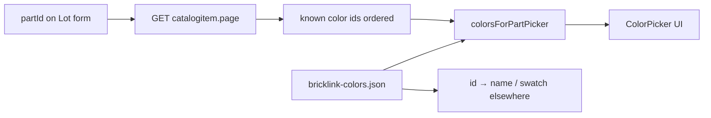

# BrickLink colors — catalog data & per-part known colors

How to power the **color picker** and any UI that maps BrickLink **color ID** → name, swatch, or hex.

**Consumers:** Lot form `ColorPicker`, part-out import rows, list tables, reconciliation display.

**Raw notes:** [dcv/colors/readme.md](../dcv/colors/readme.md)

**Reference implementation (sibling repo):** `bricklink-chrome-extension/src/lib/bricklink-colors.js`, `catalog-known-colors.js`, `src/data/bricklink-colors.json`

---

## Overview

Color support is **two layers**:

| Layer | Source | Purpose |
|-------|--------|---------|
| **1. Color catalog** | Static JSON (`bricklink-colors.json`) | All BrickLink colors — id, name, swatch hex |
| **2. Known colors for part** | GET catalog item page HTML | Subset + **order** of colors valid for a given part ID |

The picker shows **known colors** when a part is set; otherwise it searches the full catalog. Display-only views can resolve any id via the catalog alone.



---

## 1. Color catalog (static JSON)

### Schema

```json
{
  "version": 2,
  "updated": "2026-06-03",
  "colors": [
    { "id": 11, "name": "Black", "swatch": "#212121" }
  ]
}
```

| Field | Type | Required | Description |
|-------|------|----------|-------------|
| `version` | number | yes | Bump when republishing |
| `updated` | string | yes | ISO date of last build |
| `colors` | array | yes | Sorted by `name` recommended |
| `colors[].id` | number | yes | BrickLink ColorID |
| `colors[].name` | string | yes | Display name |
| `colors[].swatch` | string | no | CSS hex `#RRGGBB`; UI fallback `#CCCCCC` |

### Helpers (`bricklink-colors.js`)

| Function | Purpose |
|----------|---------|
| `colorsFromFile(file)` | Extract `colors` array |
| `getColorById(colors, id)` | Lookup by numeric id |
| `filterColors(colors, query)` | Case-insensitive filter on `name` or `id` string |

### Coordinator packaging

| Approach | Notes |
|----------|--------|
| **Copy** | `bricklink-chrome-extension/src/data/bricklink-colors.json` → e.g. `server/data/bricklink-colors.json` (or `src/data/` if client-only resolve) |
| **Rebuild** | Extension `npm run colors:build` from BrickLink color export — see extension `dcv/bulk-updates-02/colors-data-spec.md` |
| **Load** | Server reads JSON at startup; cache in memory |

~200 colors × ~40 bytes ≈ 8 KB — ship with the app.

---

## 2. Known colors for a part (catalog page scrape)

Not every catalog color applies to every part. BrickLink's catalog item page lists **Known** colors in popularity order.

### Request

| Property | Value |
|----------|--------|
| **URL** | `https://www.bricklink.com/v2/catalog/catalogitem.page?P={partId}` |
| **Method** | `GET` |
| **Example** | `https://www.bricklink.com/v2/catalog/catalogitem.page?P=15540` |

Optional deep link with color selected: `&idColor={colorId}` (not required for id list scrape).

### Authentication

| Layer | Notes |
|-------|--------|
| **Coordinator server** | `GET` with `BRICKLINK_SESSION_COOKIE` if needed; catalog pages are often public — verify in dev ([ADR-0002](../adr/0002-bricklink-ajax-only-no-iframes.md)) |
| **Extension** | `fetch(..., { credentials: 'include' })` |

### Parse targets

Prefer `#_idColorListKnown` — hidden dropdown, already sorted by counts:

```html
<div id="_idColorListKnown" class="pciSelectColorColorList">
  <div class="pciSelectColorColorItem" data-tab="Known"
       data-color="85" data-name="Dark Bluish Gray" data-rgb="#595D60">...</div>
  ...
</div>
```

**Parser** (`catalog-known-colors.js`):

- Selector: `#_idColorListKnown .pciSelectColorColorItem[data-tab="Known"]`
- Extract `data-color` → numeric color id (preserve DOM order)
- Optional future: `data-rgb`, `data-name` from page (catalog JSON is canonical for names/swatches)

Alternate scrape location (Color Info tab) documented in extension [getting-known-colors.md](https://github.com/dcvezzani/bricklink-chrome-extension/blob/main/dcv/bulk-updates-02/getting-known-colors.md) — prefer `_idColorListKnown`.

### Example `curl`

```bash
curl -s 'https://www.bricklink.com/v2/catalog/catalogitem.page?P=15540' \
  -b "$cookies" \
  -H 'accept: text/html'
```

### Merge for picker

`colorsForPartPicker(catalog, knownIds, query)`:

1. If `knownIds` non-empty → map each id through `getColorById`, preserve order, then `filterColors` by query
2. If `knownIds` empty → `filterColors` on full catalog (fallback)
3. Skip ids missing from local catalog

### Caching

In-memory cache keyed by `partId` (`fetchKnownColorIdsForPart`). Server should cache per part with TTL or session scope.

### Fixture

Inline HTML snippet for tests (part `15540` known order `85, 11, 63, 5, 2, 1`): extension `tests/catalog-known-colors.test.js` or copy to `dcv/colors/fixtures/known-colors-snippet.html` when implementing.

---

## Coordinator integration

### API (Unit 2)

| Method | Path | Response |
|--------|------|----------|
| `GET` | `/bricklink/parts/:partId/colors` | `{ colors: BricklinkColor[], knownOnly: boolean }` |

**Behavior:**

1. Load catalog from bundled JSON
2. `fetchKnownColorIdsForPart(partId)` (server-side HTML parse)
3. `colorsForPartPicker(catalog, knownIds, query)` — optional `?q=` query param for filter
4. `knownOnly: true` when known ids were returned; `false` when falling back to full catalog

### Additional endpoint (optional)

| Method | Path | Purpose |
|--------|------|---------|
| `GET` | `/bricklink/colors` | Full catalog or `?id=` single lookup — for tables that only need id → name/swatch |

### Client (`ColorPicker`)

Port extension UX ([colors-data-spec.md](https://github.com/dcvezzani/bricklink-chrome-extension/blob/main/dcv/bulk-updates-02/colors-data-spec.md)):

| Action | Spec |
|--------|------|
| Open | Trigger → panel with swatch list |
| Filter | Debounced query → server or client `filterColors` |
| Select | Set `colorId`; show name + swatch on trigger |
| Part change | Refetch known colors for new part id |

**After color select:** If part + condition set, may trigger inventory search / duplicate check (see [bricklink-store-inventory-search.md](bricklink-store-inventory-search.md)).

### Display elsewhere

Any row with `color_id` only: `getColorById(catalog, color_id)` for name and swatch — no catalog page fetch required.

---

## Failure modes

| Case | Behavior |
|------|----------|
| Unknown `partId` | Empty known list → full catalog in picker |
| Catalog page fetch fails | Empty known list → full catalog fallback |
| Color id in known list but missing from JSON | Skip entry; refresh JSON via `colors:build` |
| `AbortError` | Propagate (cancelled request) |

---

## Tests

Port from extension:

| Module | Tests |
|--------|--------|
| `bricklink-colors.js` | `filterColors`, `getColorById`, `colorsFromFile` |
| `catalog-known-colors.js` | `parseKnownColorIdsFromHtml`, `colorsForPartPicker`, URL builder, cache |

| Case | Assert |
|------|--------|
| Known HTML fixture | Ordered ids `[85, 11, 63, 5, 2, 1]` |
| `colorsForPartPicker` + query `"blue"` | Subset matching name |
| Empty known ids | Falls back to catalog filter |
| API integration | Part with known colors returns ordered subset |

---

## Related docs

- [Tech Spec — Bricklink helpers](../feature/part-out-coordinator/tech-spec.md#bricklink-helpers-unit-2)
- [docs/bricklink-store-inventory-search.md](bricklink-store-inventory-search.md) — color filter after `list.ajax`
- [PROJECT.md — Color picker row](../PROJECT.md#design-reference--bricklink-chrome-extension)
- Extension: `dcv/bulk-updates-02/colors-data-spec.md`, `getting-known-colors.md`
