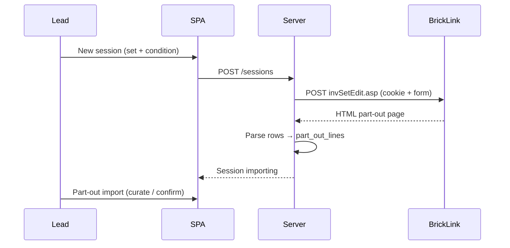

# BrickLink set part-out list — fetch & parse

How to obtain the official **part-out list** for a LEGO set from BrickLink. The coordinator uses this on session create ([ADR-0004](../adr/0004-part-out-server-fetch-curated-import.md)); this document is the contract for the upstream BrickLink call.

**Raw capture:** [support/set-part-out-list/request.md](support/set-part-out-list/request.md) · sample HTML response: [support/set-part-out-list/response.html](support/set-part-out-list/response.html)

---

## Overview

BrickLink exposes set part-out as a **server-rendered HTML page**, not a JSON API. To get the list programmatically:

1. **POST** to `https://www.bricklink.com/invSetEdit.asp` with a valid **store session cookie** and form fields that mirror the BrickLink “Part out a Set” wizard (set number, condition, pricing, inventory merge options).
2. **Parse** the returned HTML into structured rows (part id, color, condition, qty, Remarks, optional lot id).
3. **Store** as JSON for the coordinator (import curation, reconciliation, XML export).

Parser reference (sibling repo): `bricklink-chrome-extension/src/lib/inv-set-edit-dom.js`, `scripts/code-scraper.js`.

---

## Authentication

BrickLink integration uses a **logged-in store session cookie** — there is no public REST API key ([PROJECT.md](../PROJECT.md#design-reference--bricklink-chrome-extension)).

| Approach | Who holds the cookie | Use in coordinator |
|----------|----------------------|-------------------|
| **Server env** | Coordinator Node process | `BRICKLINK_SESSION_COOKIE` — preferred for MVP ([tech-spec](../feature/part-out-coordinator/tech-spec.md)) |
| **User paste** | Browser / lead pastes cookie into counter tool | Tool makes the POST with `Cookie` header (AJAX from client or relay via server) |
| **Chrome extension** | Extension content script on bricklink.com | Extension fetches, parses, and sends JSON to the counter tool (future/alternate path) |

The cookie must be from an account that can part out the target set into **My Store Inventory**. Rotate by updating env or re-pasting when sessions expire.

---

## Request

| Field | Value |
|-------|-------|
| **Method** | `POST` |
| **URL** | `https://www.bricklink.com/invSetEdit.asp` |
| **Content-Type** | `application/x-www-form-urlencoded` |
| **Cookie** | BrickLink session cookie (e.g. `BRICKLINK_SESSION_COOKIE` or user-provided `${sessionCookie}`) |
| **Referer** | `https://www.bricklink.com/invSet.asp` (same-origin) |

### Form body (key fields)

Values below match a real capture for set **21306**; the coordinator maps **New session** user inputs into `itemNo` (bare set id — substring before first `-` in stored `set_number`; auto-append `-1` to stored form when user omits a hyphen) and `itemCondition` from `part_out_options.condition`. Pricing and `invAdjust*` fields are **fixed server constants** from the canonical sample, not SPA inputs.

| Field | Example | Meaning |
|-------|---------|---------|
| `itemType` | `S` | Item type: **S**et |
| `itemNo` | `21306` | Bare set id — substring before first `-` in session `set_number` (e.g. `70404-1` or `70404-2` → `70404`) |
| `itemSeq` | `1` | Set sequence (usually `1`) |
| `itemQty` | `1` | Number of sets to part out |
| `breakType` | `M` | Break type (BrickLink wizard default in extension: `M`) |
| `breakSets` | `Y` | Break sets flag |
| `itemCondition` | `N` | **N**ew or **U**sed — maps to session new/used choice |
| `itemPrice` | `I` | Pricing basis (inventory pricing in wizard) |
| `itemRound` | `2` | Price rounding option |
| `itemBulk` | `1` | Bulk quantity handling |
| `itemDesc` | *(empty)* | Optional description |
| `itemRemarks` | *(empty)* | Optional set-level remarks |
| `invDup` | `Y` | Duplicate-inventory handling |
| `invAdjustPrice` | `N` | Per-field adjust when merging with existing inventory |
| `invAdjustBulk` | `O` | |
| `invAdjustSale` | `O` | |
| `invAdjustRemarks` | `N` | |
| `invAdjustExtended` | `O` | |
| `invAdjustStock` | `O` | |
| `invAdjustRetain` | `O` | |
| `invAdjustCost` | `O` | |
| `invAdjustWeight` | `O` | |
| `ItemInvSort` | `1` | Sort order for generated inventory rows |
| `ItemInvAsc` | `A` | Sort direction |

`invAdjust*` values encode **overwrite vs consolidate** (and related) choices from the BrickLink wizard. MVP uses **fixed constants** from the canonical sample in [request.md](support/set-part-out-list/request.md) — not user-configurable in the New session form. Tier qty fields (`TQ1`…`TS3`) are empty in the sample.

### Example `curl`

Replace `${sessionCookie}` with a valid BrickLink session cookie and `itemNo` with the target set.

```bash
curl 'https://www.bricklink.com/invSetEdit.asp' \
  -H 'accept: text/html,application/xhtml+xml,application/xml;q=0.9,*/*;q=0.8' \
  -H 'content-type: application/x-www-form-urlencoded' \
  -b '${sessionCookie}' \
  -H 'origin: https://www.bricklink.com' \
  -H 'referer: https://www.bricklink.com/invSet.asp?utm_content=subnav' \
  --data-raw 'itemType=S&sellerOptionCost=&sellerOptionMyWeight=&sellerOptionStock=&itemNo=21306&itemSeq=1&itemQty=1&breakType=M&breakSets=Y&itemCondition=N&itemPrice=I&itemRound=2&itemBulk=1&itemDesc=&itemRemarks=&TQ1=&TS1=&TQ2=&TS2=&TQ3=&TS3=&invDup=Y&invAdjustPrice=N&invAdjustBulk=O&invAdjustSale=O&invAdjustRemarks=N&invAdjustExtended=O&invAdjustStock=O&invAdjustRetain=O&invAdjustCost=O&invAdjustWeight=O&ItemInvSort=1&ItemInvAsc=A'
```

In Node, prefer `fetch` with `credentials` omitted and an explicit `Cookie` header (server-side only — never expose the cookie to the browser SPA).

---

## Response

- **Format:** HTML document titled “BrickLink Part out a Set into My Store Inventory”.
- **Sample:** [support/set-part-out-list/response.html](support/set-part-out-list/response.html) (~2.4 MB; full page for set 21306).
- **Must be transformed to JSON** before the counting tool can consume it.

### Row structure (parse targets)

Each line item appears as a table row (`tr[valign="TOP"]` with `a[id^="imgLink"]`). Per row, extract at minimum:

| Parsed field | DOM source (see `code-scraper.js`) |
|--------------|-------------------------------------|
| Part ID | Hidden `itemNo{N}` or catalog link |
| Description | Label font **Description:** |
| Qty | Label font **Qty:** |
| Condition | Hidden `nC{N}` (`N` / `U`) |
| My Remarks | Input `nM{N}` (storage location — flows to organizer pick lists) |
| Color | Color swatch / hidden fields (parser in `inv-set-edit-dom.js`) |
| Existing lot id | Optional — from duplicate-inventory warning row |

Target JSON shape: align with `fixtures/part-out-sample.json` and extension `getAllRowsValues()` output (`partID`, `myRemarks`, `description`, `amount`, `condition`, color ids, etc.).

### Parse implementation

| Layer | Module |
|-------|--------|
| DOM helpers | `bricklink-chrome-extension/src/lib/inv-set-edit-dom.js` |
| Console scraper / field map | `bricklink-chrome-extension/scripts/code-scraper.js` |
| Coordinator (planned) | `server/bricklink/part-out-fetch.js` + `part-out-parser.js` |

Use **HTML parsing on the server** (e.g. `node-html-parser` or `cheerio`) with the same selectors as the extension — **no iframes** ([ADR-0002](../adr/0002-bricklink-ajax-only-no-iframes.md)).

---

## Coordinator flow



On fetch failure: `part_out_fetch_status=error`; lead may `POST /sessions/:id/part-out/refetch`. Dev without cookie: seed from `fixtures/part-out-sample.json`.

---

## Related docs

- [ADR-0004: Server fetch + curated import](../adr/0004-part-out-server-fetch-curated-import.md)
- [Tech Spec — Part-out fetch & import](../feature/part-out-coordinator/tech-spec.md#part-out-fetch--import-unit-1)
- [PROJECT.md — BrickLink extension map](../PROJECT.md#design-reference--bricklink-chrome-extension)
