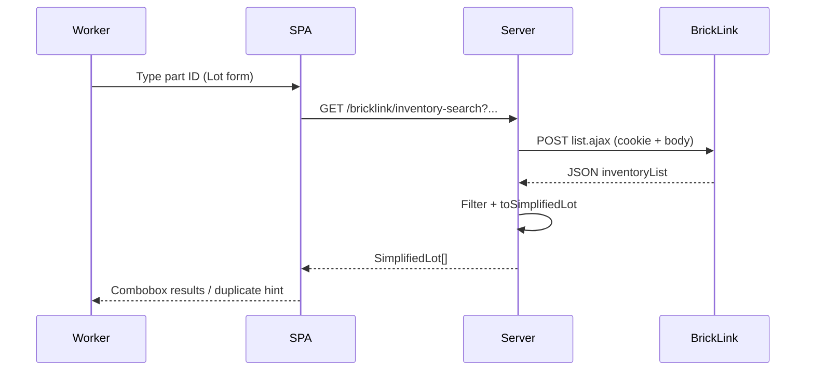

# BrickLink store inventory search — `list.ajax`

How to search **your store's inventory** on BrickLink by part number or lot ID. The coordinator uses this on **Lot form** part lookup ([tech-spec](../feature/part-out-coordinator/tech-spec.md)); this document is the contract for the upstream BrickLink call.

**Not catalog search:** This returns lots already in **My Store Inventory**, not Rebrickable-style global part autocomplete. Workers can still type a part ID manually.

**Raw capture:** [support/search-parts/store-inventory-detail-list-query.md](support/search-parts/store-inventory-detail-list-query.md) (curl + full JSON fixture) · API notes: [support/search-parts/store-inventory-api.md](support/search-parts/store-inventory-api.md)

**Reference implementation (sibling repo):** `bricklink-chrome-extension/src/lib/store-inventory-list.js`

---

## Overview

BrickLink exposes store inventory search as a **JSON AJAX endpoint**:

1. **POST** to `https://www.bricklink.com/ajax/renovate/storeInventoryDetail/list.ajax` with session cookie and urlencoded form body.
2. **Parse** `inventoryList` from JSON (`returnCode === 0`).
3. **Filter client-side** by color (and optionally condition) — server color filter (`n4ColorID`) is unreliable.
4. **Map** rows to a simplified lot shape for the Lot form / duplicate checks.

---

## Authentication

| Layer | Cookie handling |
|-------|-----------------|
| **Coordinator server (MVP)** | `BRICKLINK_SESSION_COOKIE` env var — server POSTs with `Cookie` header; **never** sent to browser ([ADR-0002](../adr/0002-bricklink-ajax-only-no-iframes.md)) |
| **Extension (reference)** | `fetch(..., { credentials: 'include' })` in browser on `bricklink.com` |

Cookie must be from a logged-in BrickLink store account with access to the inventory being searched.

---

## Endpoint

| Property | Value |
|----------|--------|
| **URL** | `https://www.bricklink.com/ajax/renovate/storeInventoryDetail/list.ajax` |
| **Method** | `POST` (GET with query string also works; prefer POST for body length) |
| **Content-Type** | `application/x-www-form-urlencoded; charset=UTF-8` |
| **Headers** | `X-Requested-With: XMLHttpRequest`, `Accept: */*` |
| **Referer** | `https://www.bricklink.com/v2/inventory_detail.page?...` (same-origin) |

### Example `curl`

Replace `$cookies` with a valid BrickLink session cookie. See [support/search-parts/store-inventory-detail-list-query.md](support/search-parts/store-inventory-detail-list-query.md) for the full baseline body.

```bash
curl 'https://www.bricklink.com/ajax/renovate/storeInventoryDetail/list.ajax' \
  -H 'content-type: application/x-www-form-urlencoded; charset=UTF-8' \
  -H 'x-requested-with: XMLHttpRequest' \
  -b "$cookies" \
  --data-raw 'n4ItemID=-1&n4CatID=-1&n4ColorID=-1&n4ColorType=-1&strCatType=P&n4ItemYear=-1&strInvNew=U&n4BindType=-1&strInvAvailable=&strItemObsolete=&strItemWanted=&strNoIn=&strViewUnique=&strSetNo=&n1SetSeq=1&strBreakType=M&n4InvID=-1&strItemStatus=&strItemReserved=&strItemStock=&strItemChild=&strNoImageXref=&strNoImageS=&strNoImageL=&strNoInv=&strNoWeight=&strNoMyWeight=&strNoRemarks=&strNoCost=&strInvTier=&strInvRetain=&strNoIC=&strNoPackDim=&n4ViewSale=-100&strInvComplete=&n4InvDays=-1&strInvDaysType=O&n4InvSoldDays=-1&strInvSoldDaysType=O&n4QMin=-1&n4QMax=-1&n4BMin=-1&n4BMax=-1&mPMin=-1&mPMax=-1&n4BindID=-1&strQuery=3001&strInvSearch=D&strRmkTP=W&strItemStockExclude=&viewPriceGuide=&pg=1&uploadDone=&invSort=&invSize=&invAsc=&invBindSort=&invBindSize=&invBindAsc='
```

---

## Request parameters

### Baseline (defaults)

Port `BASE_LIST_PARAMS` from `store-inventory-list.js` — copy the full block from the raw capture. Most keys stay at `-1` or empty for every request.

### Keys that change per request

| Key | Part search | Lot ID search | Notes |
|-----|-------------|---------------|-------|
| `strQuery` | Part ID (e.g. `3001`) | `` (empty) | Primary search term |
| `strInvNew` | `U` or `N` | `U` default | Condition filter |
| `strCatType` | `P` | `P` | Parts only for MVP; minifigs later |
| `n4InvID` | `-1` | Lot ID (e.g. `536108997`) | Direct lot lookup |
| `n4ColorID` | `-1` | `-1` | **Do not rely on server** — filter in app |
| `pg` | `1` | `1` | Page 1 only for MVP |

### Query modes

**3.1 By part number (+ condition)**

Use when searching by part ID (Lot form typeahead).

| Parameter | Value |
|-----------|--------|
| `strQuery` | Part ID |
| `strInvNew` | `U` or `N` from row/session condition |
| `strCatType` | `P` |
| `n4InvID` | `-1` |

**Client filter after response:**

```js
rows.filter((r) => !colorId || r.ColorID === Number(colorId))
```

When `colorId` is omitted, use the full list (first row drives thumbnail/description for part-only match).

**3.2 By store inventory lot ID**

Use when `storeInventoryLotId` is known (e.g. duplicate link, part-out line lot id).

| Parameter | Value |
|-----------|--------|
| `n4InvID` | Lot ID |
| `strQuery` | `` |
| `strCatType` | `P` |

Expect 0 or 1 primary match.

---

## Response

```ts
{
  returnCode: number;      // 0 = success
  returnMessage: string;   // e.g. "SUCC"
  inventoryList: InventoryRow[];
  totalInvRes: number;
  curPage: number;
}
```

**Failure:** Non-zero `returnCode`, empty body, or HTTP error → treat as no lots; surface optional error in UI.

**Fixture:** Full sample for part `3001` (11 rows) in [support/search-parts/store-inventory-detail-list-query.md](support/search-parts/store-inventory-detail-list-query.md) (Response section).

### Key `inventoryList` row fields

| Field | Use |
|-------|-----|
| `invID` | Store lot ID (`storeInventoryLotId`) |
| `ItemNo` | Part ID |
| `ItemName` | Part name |
| `ColorID`, `ColorName` | Color |
| `invNew` | `N` / `U` condition |
| `invQty` | Quantity in store |
| `invPrice` | Price |
| `invRemarks` | **My Remarks** / storage location |
| `invDescription` | Lot description (preferred over catalog fallback) |
| `imgThumbnailURL`, `imgURL` | Thumbnail and catalog image link |
| `itemType`, `itemTypeName` | Item type (`P` = Part) |
| `invRetain`, `invStock` | Retain / stockroom flags |

---

## Simplified lot mapper

Port `toSimplifiedLot()` from `store-inventory-list.js`:

```js
{
  thumbnailUrl,       // normalizeImageUrl(imgThumbnailURL)
  partId,             // ItemNo
  name,               // ItemName
  price,              // invPrice
  storeInventoryLotId,// invID
  quantity,           // invQty
  color: { id, name },
  itemType: { id, name },
  condition,          // invNew → "N" | "U"
  description,        // invDescription or ColorName + ItemName
  location,           // invRemarks
  retain,             // invRetain === "Y"
  stockroom,          // invStock === "Y"
  existsInStoreInventory: true,
  catalogItemUrl,
}
```

`normalizeImageUrl`: prefix `https:` when URL starts with `//`.  
`catalogItemUrlFromRow`: prefer `https://www.bricklink.com${imgURL}` when present.

---

## Matching rules (Lot form)

| Scenario | API call | Pick row |
|----------|----------|----------|
| Part + color + condition | 3.1 + filter | First where `ColorID` and `invNew` match |
| Part + condition (no color) | 3.1 | First where `invNew` matches |
| Part only | 3.1 | First in list |
| Lot ID | 3.2 | First in list |
| Duplicate awareness | Same as above | `existsInStoreInventory = filtered.length > 0` |

Helper functions to port: `filterInventoryRows`, `findLotForLoad`, `hasMatchingLot`, `isExactTripleMatch` — all in `store-inventory-list.js`.

---

## Coordinator integration



### Coordinator API (planned)

| Method | Path | Upstream |
|--------|------|----------|
| `GET` | `/bricklink/inventory-search` | `list.ajax` mode 3.1 |

**Query params (proposed):**

| Param | Required | Maps to |
|-------|----------|---------|
| `q` or `partId` | Yes* | `strQuery` |
| `condition` | No | `strInvNew` (`N` / `U`) |
| `colorId` | No | Client filter after fetch |
| `lotId` | No* | `n4InvID` (mode 3.2; omit `q`) |

\* Either `partId`/`q` or `lotId`, not both.

**Response:** `{ lots: SimplifiedLot[] }`

### Client UX (Lot form)

| Rule | Value |
|------|--------|
| Debounce | **400 ms** after last keystroke |
| Abort | `AbortController` — cancel prior request on input change |
| Concurrency | Cap in-flight search requests (extension uses max **3** globally; server may rate-limit separately) |
| Pagination | **Page 1 only** (`pg=1`); if `totalInvRes` > returned length, results may be incomplete — acceptable MVP limitation |

---

## Security

- **Coordinator:** BrickLink cookie in server env only; browser calls coordinator REST, not BrickLink directly.
- **No iframes** for inventory lookup — use this AJAX endpoint only ([ADR-0002](../adr/0002-bricklink-ajax-only-no-iframes.md)). Do **not** port `inventory-iframe-lookup.js`.
- Do not log full cookie values or persist inventory snapshots beyond session needs.

---

## Tests

| Case | Assert |
|------|--------|
| `buildListAjaxBody` | Part search sets `strQuery`, `strInvNew`; lot search sets `n4InvID`, clears `strQuery` |
| `toSimplifiedLot` | Fixture row → all simplified fields |
| `filterInventoryRows` | Two colors in list → filter returns one |
| `normalizeImageUrl` | `//img...` → `https://img...` |
| HTTP failure / `returnCode !== 0` | Returns empty array |

Fixture source: truncated or full `inventoryList` from [store-inventory-detail-list-query.md](support/search-parts/store-inventory-detail-list-query.md).

---

## Related docs

- [ADR-0002: AJAX only, no iframes](../adr/0002-bricklink-ajax-only-no-iframes.md)
- [Tech Spec — Bricklink helpers](../feature/part-out-coordinator/tech-spec.md#bricklink-helpers-unit-2)
- [PROJECT.md — extension module map](../PROJECT.md#design-reference--bricklink-chrome-extension)
- Extension: `bricklink-chrome-extension/src/lib/store-inventory-list.js`, `tests/store-inventory-list.test.js`
