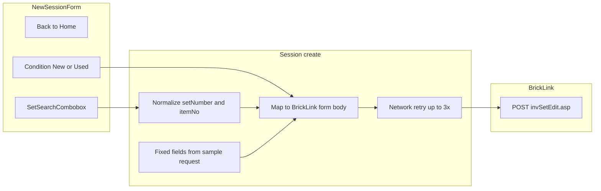

# New session

**Status:** Draft — for Dave review  
**Last updated:** 2026-06-12 (Dave product decisions — Back to Home, set picker, validation, error copy)

---

## Overview

| Field | Value |
|-------|-------|
| **View name** | New session |
| **Route** | `/session/new` |
| **Route params** | — |
| **Query params** | — |
| **Primary actor(s)** | Session lead (process role — any worker with a display name from Home can open this route; creator becomes session lead) |
| **Delivery unit** | 0 (fixture) → 1 (live create + BrickLink fetch) |
| **Source file** | [`src/views/NewSessionView.vue`](../../src/views/NewSessionView.vue) |

## Related docs

- [Product Spec — Application views](../../feature/part-out-coordinator/product-spec.md#application-views)
- [Product Spec — Scenario 2: New session](../../feature/part-out-coordinator/product-spec.md#key-scenarios)
- [Tech Spec — Sessions & part-out fetch](../../feature/part-out-coordinator/tech-spec.md#sessions-unit-1)
- [Planned views & services — New session](../support/planned-views-services.md#2-new-session)
- [Storyboard walkthrough § 2. New session](../support/storyboard.md#2-new-session)
- [Shared chrome](./README.md#shared-chrome)
- [ADR-0004 — Part-out server fetch](../../adr/0004-part-out-server-fetch-curated-import.md)
- [Set part-out list — request capture](../support/set-part-out-list/request.md) — canonical `curl` and fixed form values
- [BrickLink set part-out fetch](../bricklink-set-part-out-fetch.md) — server mapping contract
- [Session phases state diagram](../diagrams/session-phases-state.mmd)
- [View navigation diagram](../diagrams/view-navigation.mmd)
- [Workflow storyboard diagram](../diagrams/workflow-storyboard.mmd)
- [Part-out import fetch states](../diagrams/part-out-import-fetch-state.mmd) — cross-reference for network failure after create

## Purpose

Session lead specifies the LEGO **set number** and **condition** (New or Used), then submits so the coordinator fetches the official part-out list and creates a session in the **importing** phase. Pricing and inventory-merge behavior use **fixed BrickLink wizard defaults** from the sample request — they are not exposed in this form.

**Session naming:** MVP derives `{normalizedSetNumber} part-out` on create only. Custom names (e.g. storyboard fixture `Castle 70404 — June part-out`) are **illustrative** — not the create formula.

## Locked decisions

| Topic | Decision |
|-------|----------|
| Form scope | **Set number + condition only** in the SPA; pricing and inventory merge are server-side constants from [request.md](../support/set-part-out-list/request.md). |
| Condition | **New** or **Used** only — no Mixed. Partial-bag two-sweep uses **two separate sessions** ([lot-form.md](./lot-form.md)). |
| Default condition | **None** — lead must explicitly select New or Used before submit. |
| Set number input | **Set search picker** — new component modeled on [`PartSearchCombobox`](../../src/components/PartSearchCombobox.vue) + [`FilterablePicker`](../../src/components/FilterablePicker.vue) (searchable set list; not a plain text field). |
| Set number storage | Trim whitespace. If selection has **no `-`**, auto-append `-1` (e.g. `70404` → `70404-1`). If user picks or enters a suffix (e.g. `70404-2`), **persist as-is**. Stored form is always `{base}-{variant}`. |
| Set number validation (client) | **Pattern required before submit:** one or more digits, optional `-` + variant digits (`^\d+(-\d+)?$` after trim). Block submit with inline destructive alert — do not call `POST /api/v1/sessions` until valid. Server/BrickLink 422 remains fallback for sets that match pattern but are unknown. |
| Set number → BrickLink `itemNo` | **`itemNo` = substring before the first `-`** in stored `setNumber` (e.g. `70404-1` → `70404`, `70404-2` → `70404`). Matches canonical sample (`itemNo=21306` in [request.md](../support/set-part-out-list/request.md)). |
| Session name | Server-derived: `{storedSetNumber} part-out`. No editable name field on this view. |
| `partOutOptions` (persisted) | **Condition only** (`new` \| `used`). Pricing and overwrite are not stored — fixed at fetch time. |
| Session lead | Creating worker is persisted as `lead_worker_id` on the session (**audit metadata only** — not authorization for phase transitions; see [process-roles.md](../process-roles.md)). |
| Display name | Set on **Home** only. Apply [Home display name rules](./home.md#display-name-rules) (trim + case-fold) before `POST`. No editable name field here; no silent `"Session Lead"` fallback. |
| Direct entry without display name | **Redirect immediately to Home** (`/`) — route guard before New session renders; no toast on this view. |
| Display name feedback | **Route guard** handles missing name on entry (redirect). **Destructive alert** on submit only if name was cleared after arrival (defense in depth) — “Enter your display name first”; use **Back to Home**. |
| Fetch failure — invalid set | BrickLink rejects or returns an unparseable part-out → **HTTP 422**, **no session created**; **fixed client wrapper** destructive alert (see [Messages](#messages--feedback)); stay on New session. |
| Fetch failure — network | Server **retries the BrickLink POST up to 3 times** during `POST /api/v1/sessions`. If all retries fail, session **is created** in `importing` with `part_out_fetch_status=error`; client navigates to Part-out import — import view shows **Loading then Error** ([part-out-import.md — Create-time fetch error entry](./part-out-import.md#create-time-fetch-error-entry)). |
| Back to Home | **Explicit control** — link or secondary button (e.g. “← Back to Home”) navigates to `/`. Do not rely on browser back or AppShell header alone. |
| Shell chrome | Renders inside [`AppShell`](../../src/components/AppShell.vue) (header + storyboard badge in fixture mode). **SessionNav is hidden** — no `sessionId` in route until after create. |

## Entry & exit

### How users arrive

| From | Path / action |
|------|---------------|
| Home → **Create new session** | `/session/new` (requires normalized `workerDisplayName` in `sessionStorage`) |
| Direct navigation / bookmark | `/session/new` without `workerDisplayName` → **immediate redirect to Home** (`/`). No toast on New session; user enters name on Home then **Create new session**. |

### Where actions navigate

| Action | Destination |
|--------|-------------|
| **Back to Home** | `/` |
| **Create session & fetch part-out** (`POST` succeeds — fetch ok or error) | `/session/:sessionId/import` |
| Invalid set number on create (live) | Stay on `/session/new` — no session created |

## Layout & controls

### Target (Unit 1+)

| Element | Copy / behavior |
|---------|-----------------|
| Page heading | New session |
| **Back to Home** | Link or secondary button → `/` (`data-testid="back-to-home"`) |
| Helper text (live) | Set number and condition (New or Used). Pricing and inventory merge use fixed BrickLink defaults. |
| Display name missing (route guard) | Redirect to `/` before New session renders — user never sees the form without a name from Home |
| Display name missing (on submit) | Destructive alert: Enter your display name first — use **Back to Home** (edge case: name cleared after arrival) |
| Label | Set number |
| Set search picker | [`SetSearchCombobox`](../../src/components/SetSearchCombobox.vue) *(planned)* — wraps [`FilterablePicker`](../../src/components/FilterablePicker.vue); searchable set catalog; placeholder e.g. `70404-1`; default selection `70404-1` (editable). Replaces plain text input from Unit 0. |
| **Condition** (radio) | New · Used — **no default selected** |
| Submit button | Create session & fetch part-out — disabled while request in flight or set number fails client pattern validation |

### Storyboard (Unit 0 today)

Legacy UI in [`NewSessionView.vue`](../../src/views/NewSessionView.vue) still shows pricing basis, condition mix (including **Mixed**), and existing-lots option groups — **not** target behavior.

| Element | Copy / behavior (Unit 0 only) |
|---------|-------------------------------|
| Helper text | From [`app-preferences.json`](../../config/app-preferences.json) `storyboard.newSessionHelper` — already uses **target** copy (“Set number and condition… fixed BrickLink defaults”) |
| Label | Pricing basis |
| Radio | Stock guide · Last 6 months sales |
| Label | Condition mix |
| Radio | New · Used · **Mixed** |
| Label | Existing lots |
| Radio | Consolidate with existing · Overwrite existing |
| Condition default | Component reads `appConfig.newSession.defaults.condition` — **undefined in config today**; storyboard may show no selection or fall through to empty; legacy intent was `mixed` |

### BrickLink part-out request mapping

The server POSTs to `invSetEdit.asp` on create. Only **set number** and **condition** come from this form; all other form fields match the canonical sample in [request.md](../support/set-part-out-list/request.md). Implementation details: [bricklink-set-part-out-fetch.md](../bricklink-set-part-out-fetch.md).

#### User inputs

| UI field | Stored value | BrickLink field |
|----------|--------------|-----------------|
| Set number | `setNumber` (`{base}-{variant}`, e.g. `70404-1` or `70404-2`) | `itemNo` (base before first `-`, e.g. `70404`) |
| Condition: New | `new` | `itemCondition=N` |
| Condition: Used | `used` | `itemCondition=U` |

Session-wide lot condition drives the read-only label on Lot form. Fetched part-out rows may show per-line condition in the import table; session condition is the sweep scope for counting.

#### Fixed BrickLink parameters (not user-configurable)

These values are server-side constants on create, taken from the sample `--data-raw` in [request.md](../support/set-part-out-list/request.md):

| Field | Value | Notes |
|-------|-------|-------|
| `itemType` | `S` | |
| `itemSeq` | `1` | |
| `itemQty` | `1` | |
| `breakType` | `M` | |
| `breakSets` | `Y` | |
| `itemPrice` | `I` | Inventory pricing per canonical sample — not user-selectable in MVP |
| `itemRound` | `2` | |
| `itemBulk` | `1` | |
| `itemDesc` | *(empty)* | |
| `itemRemarks` | *(empty)* | |
| `invDup` | `Y` | |
| `invAdjustPrice` | `N` | |
| `invAdjustBulk` | `O` | |
| `invAdjustSale` | `O` | |
| `invAdjustRemarks` | `N` | |
| `invAdjustExtended` | `O` | |
| `invAdjustStock` | `O` | |
| `invAdjustRetain` | `O` | |
| `invAdjustCost` | `O` | |
| `invAdjustWeight` | `O` | |
| `ItemInvSort` | `1` | |
| `ItemInvAsc` | `A` | |
| `TQ1`–`TS3` | *(empty)* | |
| `sellerOptionCost`, `sellerOptionMyWeight`, `sellerOptionStock` | *(empty)* | |

**Pricing** (`itemPrice`, `itemRound`, `itemBulk`) and **lot consolidation / duplicate inventory** (`invDup`, `invAdjust*`) are **not** exposed in the SPA; the server always sends these values when POSTing `invSetEdit.asp`.



## Validation & normalization

Single reference for field rules (also reflected in Locked decisions):

| Field | Rule |
|-------|------|
| Set number | Selected via **SetSearchCombobox** (FilterablePicker). Trim; block empty submit. Client pattern: `^\d+(-\d+)?$` after trim — show inline destructive alert if invalid; **do not submit**. If valid and no `-`, append `-1` on blur or submit. Preserve suffix (e.g. `70404-2`). Unknown-but-valid pattern may still 422 from server. |
| Set number → `itemNo` | Substring before first `-` in stored `setNumber`. |
| Condition | Required before submit; destructive alert if neither New nor Used selected. |
| Display name | Read `workerDisplayName` from `sessionStorage`. **Route guard** redirects to `/` if missing on entry. Apply trim + case-fold per [home.md](./home.md#display-name-rules) before API body; write normalized value back on create success. Destructive alert on submit if name cleared mid-session. |

## Submit outcomes (Unit 1+)

| Outcome | HTTP | Session created? | `partOutFetchStatus` | Navigation | User feedback |
|---------|------|------------------|----------------------|------------|---------------|
| Valid set, fetch OK | 201 | Yes | `ok` | `/session/:sessionId/import` | — |
| Invalid set | 422 | No | — | Stay on `/session/new` | Fixed client wrapper alert (see [Messages](#messages--feedback)); optional server detail |
| Network exhausted (3 retries) | 201 | Yes | `error` | `/session/:sessionId/import` | Import: **Loading then Error** — [part-out-import.md — Create-time fetch error entry](./part-out-import.md#create-time-fetch-error-entry) |

Server performs network retries (up to 3) — not the browser client.

## Submit & loading (Unit 1+)

| State | Behavior |
|-------|----------|
| Idle | Submit enabled when display name present, set number non-empty, condition selected |
| In flight | Submit disabled; inline “Fetching part-out…” helper (MVP — no progress bar) |
| Invalid set | Stay on view; show fixed client wrapper alert; **no** navigation |
| Network exhausted | Navigate to import view; session persisted with `part_out_fetch_status=error` |
| Create success (fetch ok or error) | Store client session keys (see [Client state](#client-state)); connect WebSocket; navigate to import |

## Feedback patterns

| Pattern | Use on this view |
|---------|------------------|
| **Destructive alert** (inline, blocking) | Missing display name on **submit** (edge case); missing condition on submit; invalid set after 422; client set pattern failure |
| **Helper text** | Always-visible form guidance; “Fetching part-out…” while in flight |

## Messages & feedback

### Unit 0 (fixture)

| Message | Type | Trigger |
|---------|------|---------|
| Set number and condition (New or Used). Pricing and inventory merge use fixed BrickLink defaults. Server fetch is simulated in storyboard. | Helper text | Always (from config) |
| *(none)* | — | No condition-required, display-name, or toast validation in storyboard today |

### Unit 1+ (live)

| Message | Type | Trigger |
|---------|------|---------|
| Set number and condition (New or Used). Pricing and inventory merge use fixed BrickLink defaults. | Helper text | Always |
| Enter your display name first | Destructive alert | Submit with missing `workerDisplayName` (name cleared after arrival) |
| Select New or Used condition | Destructive alert / inline | Submit with no condition selected |
| Enter a valid set number (e.g. 70404 or 70404-1) | Destructive alert / inline | Submit with set number that fails client pattern validation |
| That set number didn't work. Check the set number and try again. | Destructive alert (title or primary line) | Invalid set — HTTP 422; stay on view |
| *(optional secondary)* {server message} | Destructive alert detail | Same 422 — e.g. “Set not found or part-out list could not be parsed” |
| Fetching part-out… | Helper text / disabled submit | Create request in flight |
| *(import view)* | Loading then Error | Network failure after retries — see [part-out-import.md — Create-time fetch error entry](./part-out-import.md#create-time-fetch-error-entry) |

## User actions

| Action | Preconditions | Outcome |
|--------|---------------|---------|
| **Back to Home** | — | Navigate to `/` |
| Search / select set number | — | Updates form state via SetSearchCombobox; normalizes on blur/submit when pattern valid |
| Select condition (New or Used) | — | Stored in `partOutOptions.condition` on create |
| Create session & fetch part-out | Normalized `workerDisplayName` in `sessionStorage`; set number passes client pattern; condition selected | `POST /api/v1/sessions` creates session (phase `importing`), sets `lead_worker_id` to creator, persists client keys, connects WebSocket, navigates to Part-out import when HTTP 201 (including fetch error status) |

## Client state

| When | `sessionStorage` keys | In-memory (`useSession`) |
|------|----------------------|--------------------------|
| Arrive from Home | `workerDisplayName` (normalized) | — |
| Create success (Unit 1+) | `workerDisplayName`, `currentSessionId`, `currentWorkerId` (normalized name) | `setCurrentWorker(worker)` |

Unit 1+: connect `useWebSocket` after every successful `POST /api/v1/sessions` (HTTP 201, including `partOutFetchStatus=error`) before navigation to import. Display name is not persisted server-side until create.

## Data requirements

### Read

| Field / entity | Source (live) | Notes |
|----------------|---------------|-------|
| Worker display name | Client `sessionStorage` | From Home — required for submit |

### Write

| Operation | Endpoint (live) | Notes |
|-----------|-----------------|-------|
| Create session + fetch part-out | `POST /api/v1/sessions` | See [API contract](#api-contract) |

### API contract

**Request:**

```json
{
  "setNumber": "70404-1",
  "displayName": "Alex",
  "partOutOptions": { "condition": "used" }
}
```

**Response — fetch OK (HTTP 201):**

```json
{
  "sessionId": "…",
  "partOutFetchStatus": "ok",
  "partOutFetchError": null,
  "worker": { "id": "…", "displayName": "Alex" }
}
```

**Response — network failure after retries (HTTP 201):**

```json
{
  "sessionId": "…",
  "partOutFetchStatus": "error",
  "partOutFetchError": "BrickLink request failed after 3 attempts",
  "worker": { "id": "…", "displayName": "Alex" }
}
```

Client navigates to import in both 201 cases; refetch UX is on the import view.

**Response — invalid set (HTTP 422):**

```json
{
  "error": {
    "code": "INVALID_SET_NUMBER",
    "message": "Set not found or part-out list could not be parsed"
  }
}
```

No session row created.

Server-side on create: normalize `setNumber`, derive `itemNo` (base before first `-`), map to BrickLink form (`itemCondition`, fixed fields), retry BrickLink POST up to 3 times on transient failure, parse HTML → `part_out_lines` on success.

`partOutOptions` on the persisted session record carries **condition only** (`new` \| `used`).

## Acceptance criteria

### Unit 1+ (live)

- [ ] **Back to Home** control navigates to `/`
- [ ] Set number via **SetSearchCombobox** (FilterablePicker); searchable set list (e.g. `70404` → stored `70404-1`; `70404-2` stored as-is)
- [ ] Client pattern validation blocks invalid format before submit; inline alert shown
- [ ] Invalid set (422): fixed client wrapper copy; optional server message as secondary detail
- [ ] BrickLink `itemNo` is base before first `-` (e.g. `70404-2` → `70404`)
- [ ] Lead must explicitly choose **condition** (`New` or `Used`) — no pre-selected default
- [ ] Route guard: direct `/session/new` without display name redirects to Home (no New session form shown)
- [ ] Destructive alert on submit if display name cleared after arrival (no silent fallback name)
- [ ] Form does **not** expose pricing or existing-lot options
- [ ] Server fetch uses fixed pricing/consolidation values from [request.md](../support/set-part-out-list/request.md)
- [ ] Submit creates session and navigates to Part-out import when `POST /sessions` returns **201** (fetch ok **or** fetch error after retries)
- [ ] Fetched part-out lines available on import when `partOutFetchStatus=ok`; refetch offered when `error`
- [ ] Condition (`new` or `used`) persisted on session; drives read-only lot form label
- [ ] Invalid set: HTTP 422, wrapper alert on New session, no session record
- [ ] Network failure after 3 retries: session created with error status; import view uses **Loading then Error** per [part-out-import.md — Create-time fetch error entry](./part-out-import.md#create-time-fetch-error-entry)
- [ ] SessionNav **not** shown (no `sessionId` until after create)
- [ ] Creator worker stored as `lead_worker_id` on session

### Unit 0 (storyboard)

- [ ] Legacy form demonstrates set + condition + pricing + Mixed + existing-lots (target UI not required in Unit 0)
- [ ] Simulated create navigates to import with fixture lines

## Storyboard status

### Implemented (Unit 0)

- Form with set number, condition, pricing, existing-lots, and legacy Mixed radio (see [Storyboard layout](#storyboard-unit-0-today))
- Simulated create → fixture demo part-out lines cloned into new session
- Phase set to `importing`; confirm on import advances to `counting`
- Default set `70404-1` from config; helper text already matches target copy

### Gaps (Units 1–4)

- Remove pricing basis, existing-lots, and Mixed condition from UI
- No default condition; condition-required validation
- Display-name route guard (redirect to Home) + defensive alert on submit
- **SetSearchCombobox** (FilterablePicker-based set search); client pattern validation
- **Back to Home** control
- Set-number normalization (append `-1` when no hyphen; `itemNo` = base before `-`)
- Live `POST /api/v1/sessions` with server-side fetch retry
- Invalid-set (422) wrapper copy vs network failure UX
- Remove `"Session Lead"` silent fallback in [`NewSessionView.vue`](../../src/views/NewSessionView.vue)

### `data-testid` inventory

| Test id | Element | Unit |
|---------|---------|------|
| `new-session-view` | Page container | 0+ |
| `back-to-home` | Back to Home link/button | 1+ |
| `set-number` | Set search picker (SetSearchCombobox) | 1+ |
| `set-number-pattern-error` | Client pattern validation alert | 1+ |
| `set-number` | Plain set number input (legacy) | 0 |
| `condition-new` | New condition radio | 1+ |
| `condition-used` | Used condition radio | 1+ |
| `condition-required-error` | Condition validation alert | 1+ |
| `display-name-required-error` | Display name validation alert | 1+ |
| `submit-new-session` | Submit button | 0+ |

## Diagram alignment

Reviewed 2026-06-12 against [session-phases-state.mmd](../diagrams/session-phases-state.mmd), [view-navigation.mmd](../diagrams/view-navigation.mmd), [workflow-storyboard.mmd](../diagrams/workflow-storyboard.mmd), and [part-out-import-fetch-state.mmd](../diagrams/part-out-import-fetch-state.mmd). Product and Tech Specs cross-checked.

### Aligned

| Topic | Spec | Diagrams / related docs |
|-------|------|-------------------------|
| Entry route | `/session/new` | `view-navigation.mmd`, `workflow-storyboard.mmd` |
| Happy-path exit | `POST /api/v1/sessions` → `/session/:sessionId/import` | `NEW --> IMPORT` in both navigation diagrams; `workflow-storyboard.mmd` labels `POST /sessions fetch part-out` |
| Initial phase | Session created in `importing` | `session-phases-state.mmd` `[*] --> importing` on New session submit |
| SessionNav hidden | No `sessionId` on route until after create; import hides nav while `importing` | `view-navigation.mmd` subgraph note “hidden during importing”; [README — Shared chrome](./README.md#shared-chrome) |
| Home prerequisite | Display name from Home (`sessionStorage`) | `workflow-storyboard.mmd` edge label “Create new session (display name)” |
| Form scope | Set number + condition only (Unit 1+) | Product Spec scenario 2; Tech Spec create body |
| Fetch retry count | Server retries BrickLink POST up to **3×** on create | Inline mermaid in [BrickLink mapping](#bricklink-part-out-request-mapping); Tech Spec create |
| Invalid set | HTTP **422**, no session, stay on New session | Tech Spec; [planned-views-services](../support/planned-views-services.md#2-new-session) |
| Network exhausted | HTTP **201**, `partOutFetchStatus=error`, navigate to import | Tech Spec; [part-out-import.md](./part-out-import.md#loading--fetch-states) |

### Discrepancies & gaps (diagram vs this spec)

| # | Issue | Spec says | Diagram / doc gap | Resolution |
|---|-------|-----------|-------------------|------------|
| D1 | **Create submit outcomes** | Three paths: 201+ok → import; 201+error → import; 422 → stay | `workflow-storyboard.mmd` shows only happy path `NEW --> IMPORT` | **Diagram fix** — add 422 self-loop and error-status edge (see diagram PR) |
| D2 | **Fetch error still enters `importing`** | Network failure after retries creates session in `importing` with `part_out_fetch_status=error` | `session-phases-state.mmd` transition label does not distinguish inline fetch ok vs error | **Diagram note** added — both enter `importing`; refetch UX is on import view |
| D3 | **Import arrival after create-time fetch failure** | Client navigates to import; **Loading then Error** on import mount ([part-out-import.md](./part-out-import.md#create-time-fetch-error-entry)) | `part-out-import-fetch-state.mmd` documents create-error entry at Loading | **Resolved** — Dave 2026-06-12 |
| D4 | **Route path shorthand** | Full route `/session/:sessionId/import` | `view-navigation.mmd` uses `/import` (abbreviated nodes) | Intentional shorthand per post-review (#7–#9); full paths in `workflow-storyboard.mmd` and Tech Spec |
| D5 | **WebSocket on create** | Connect `useWebSocket` after every HTTP 201 before navigation | No diagram shows post-create WebSocket | Out of scope for navigation/phase diagrams; documented in [Client state](#client-state) |
| D6 | **Display name — two entry paths** | Home → New requires name; direct `/session/new` without name **redirects to Home** | Diagrams show only Home → New with display name | Spec covers redirect in [Entry & exit](#entry--exit); diagrams omit direct-nav edge (acceptable) |
| D7 | **Retry context on import diagram** | Create-time retry is inline in `POST /sessions`; import mount retry is separate (`GET` / `refetch`) | `part-out-import-fetch-state.mmd` retry states apply to **import view** load/refetch, not create | Cross-link only — not a conflict if readers distinguish create vs import retry (see [Submit outcomes](#submit-outcomes-unit-1)) |

### Ambiguities in this spec (not diagram conflicts)

| # | Topic | Notes |
|---|-------|-------|
| A1 | Set catalog source for SetSearchCombobox | FilterablePicker needs set options — fixture catalog in Unit 0; live API/catalog TBD in Tech Spec. |
| A2 | Normalize timing | Append `-1` on blur **or** submit — both valid; UX if user blurs `70404` then changes mind before submit is unspecified. |
| A3 | Unit 0 storyboard | Fixture simulates successful create with lines; no 422 or network-error paths in storyboard — acceptable for Unit 0. |

## Open questions

1. **SetSearchCombobox data source (live)** — Static/searchable fixture catalog for Unit 0; which API or catalog backs set search in Unit 1+?

**Resolved (Dave 2026-06-12):**

| Topic | Decision |
|-------|----------|
| Back to Home | Explicit control → `/` |
| Invalid set copy | Fixed client wrapper + optional server detail |
| Import mount after create-time fetch error | **Loading then Error** — no auto-refetch on mount |
| Set number validation | Client pattern `^\d+(-\d+)?$` + **SetSearchCombobox** (FilterablePicker) |
| Direct bookmark without display name | **Redirect immediately to Home** — no toast on New session |

**Deferred (no decision needed for MVP):**

- Show fetch progress / line count after create (beyond disabled submit + “Fetching part-out…” helper)? **Deferred** — MVP uses disabled submit + helper text only; see [tech-spec — DevOps](../../feature/part-out-coordinator/tech-spec.md) for timeout notes if needed.
