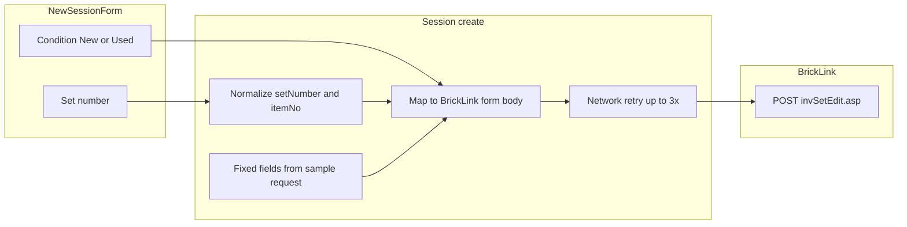

# New session

**Status:** Draft — for Dave review  
**Last updated:** 2026-06-11 (consistency review)

---

## Overview

| Field | Value |
|-------|-------|
| **View name** | New session |
| **Route** | `/session/new` |
| **Route params** | — |
| **Query params** | — |
| **Primary actor(s)** | Session lead (process role — any worker with a display name from Home can open this route; creator becomes session lead) |
| **Delivery unit** | 0 (fixture) → 1 (live create + BrickLink fetch) |
| **Source file** | [`src/views/NewSessionView.vue`](../../src/views/NewSessionView.vue) |

## Related docs

- [Product Spec — Application views](../../feature/part-out-coordinator/product-spec.md#application-views)
- [Product Spec — Scenario 2: New session](../../feature/part-out-coordinator/product-spec.md#key-scenarios)
- [Tech Spec — Sessions & part-out fetch](../../feature/part-out-coordinator/tech-spec.md#sessions-unit-1)
- [Planned views & services — New session](../support/planned-views-services.md#2-new-session)
- [Storyboard walkthrough § 2. New session](../support/storyboard.md#2-new-session)
- [Shared chrome](./README.md#shared-chrome)
- [ADR-0004 — Part-out server fetch](../../adr/0004-part-out-server-fetch-curated-import.md)
- [Set part-out list — request capture](../support/set-part-out-list/request.md) — canonical `curl` and fixed form values
- [BrickLink set part-out fetch](../bricklink-set-part-out-fetch.md) — server mapping contract

## Purpose

Session lead specifies the LEGO **set number** and **condition** (New or Used), then submits so the coordinator fetches the official part-out list and creates a session in the **importing** phase. Pricing and inventory-merge behavior use **fixed BrickLink wizard defaults** from the sample request — they are not exposed in this form.

**Session naming:** MVP derives `{normalizedSetNumber} part-out` on create only. Custom names (e.g. storyboard fixture `Castle 70404 — June part-out`) are **illustrative** — not the create formula.

## Locked decisions

| Topic | Decision |
|-------|----------|
| Form scope | **Set number + condition only** in the SPA; pricing and inventory merge are server-side constants from [request.md](../support/set-part-out-list/request.md). |
| Condition | **New** or **Used** only — no Mixed. Partial-bag two-sweep uses **two separate sessions** ([lot-form.md](./lot-form.md)). |
| Default condition | **None** — lead must explicitly select New or Used before submit. |
| Set number storage | Trim whitespace. If input has **no `-`**, auto-append `-1` (e.g. `70404` → `70404-1`). If user enters a suffix (e.g. `70404-2`), **persist as-is**. Stored form is always `{base}-{variant}`. |
| Set number → BrickLink `itemNo` | **`itemNo` = substring before the first `-`** in stored `setNumber` (e.g. `70404-1` → `70404`, `70404-2` → `70404`). Matches canonical sample (`itemNo=21306` in [request.md](../support/set-part-out-list/request.md)). |
| Session name | Server-derived: `{storedSetNumber} part-out`. No editable name field on this view. |
| `partOutOptions` (persisted) | **Condition only** (`new` \| `used`). Pricing and overwrite are not stored — fixed at fetch time. |
| Session lead | Creating worker is persisted as `lead_worker_id` on the session; first worker record is the implicit lead for phase transitions. |
| Display name | Set on **Home** only. Apply [Home display name rules](./home.md#display-name-rules) (trim + case-fold) before `POST`. No editable name field here; no silent `"Session Lead"` fallback. |
| Display name feedback | **Toast** on mount when `workerDisplayName` is missing ([Home — toast notifications](./home.md#toast-notifications)). **Destructive alert** on submit attempt with same copy as Home (“Enter your display name first”) plus instruction to return to `/`. |
| Fetch failure — invalid set | BrickLink rejects or returns an unparseable part-out → **HTTP 422**, **no session created**; destructive alert with server message; stay on New session. |
| Fetch failure — network | Server **retries the BrickLink POST up to 3 times** during `POST /api/v1/sessions`. If all retries fail, session **is created** in `importing` with `part_out_fetch_status=error`; client navigates to Part-out import for refetch ([part-out-import.md — Fetch error on mount](./part-out-import.md#fetch-error-on-mount)). |
| Shell chrome | Renders inside [`AppShell`](../../src/components/AppShell.vue) (header + storyboard badge in fixture mode). **SessionNav is hidden** — no `sessionId` in route until after create. |

## Entry & exit

### How users arrive

| From | Path / action |
|------|---------------|
| Home → **Create new session** | `/session/new` (requires normalized `workerDisplayName` in `sessionStorage`) |
| Direct navigation / bookmark | `/session/new` — toast on mount if display name missing; submit blocked until lead returns to Home |

### Where actions navigate

| Action | Destination |
|--------|-------------|
| **Create session & fetch part-out** (`POST` succeeds — fetch ok or error) | `/session/:sessionId/import` |
| Invalid set number on create (live) | Stay on `/session/new` — no session created |

## Layout & controls

### Target (Unit 1+)

| Element | Copy / behavior |
|---------|-----------------|
| Page heading | New session |
| Helper text (live) | Set number and condition (New or Used). Pricing and inventory merge use fixed BrickLink defaults. |
| Display name missing (on mount) | Toast: Enter your display name first — return to Home to enter your name |
| Display name missing (on submit) | Destructive alert: Enter your display name first — link or instruction to return to `/` |
| Label | Set number |
| Input placeholder | 70404-1 |
| Prefill set number | `70404-1` (editable) |
| **Condition** (radio) | New · Used — **no default selected** |
| Submit button | Create session & fetch part-out — disabled while request in flight |

### Storyboard (Unit 0 today)

Legacy UI in [`NewSessionView.vue`](../../src/views/NewSessionView.vue) still shows pricing basis, condition mix (including **Mixed**), and existing-lots option groups — **not** target behavior.

| Element | Copy / behavior (Unit 0 only) |
|---------|-------------------------------|
| Helper text | From [`app-preferences.json`](../../config/app-preferences.json) `storyboard.newSessionHelper` — already uses **target** copy (“Set number and condition… fixed BrickLink defaults”) |
| Label | Pricing basis |
| Radio | Stock guide · Last 6 months sales |
| Label | Condition mix |
| Radio | New · Used · **Mixed** |
| Label | Existing lots |
| Radio | Consolidate with existing · Overwrite existing |
| Condition default | Component reads `appConfig.newSession.defaults.condition` — **undefined in config today**; storyboard may show no selection or fall through to empty; legacy intent was `mixed` |

### BrickLink part-out request mapping

The server POSTs to `invSetEdit.asp` on create. Only **set number** and **condition** come from this form; all other form fields match the canonical sample in [request.md](../support/set-part-out-list/request.md). Implementation details: [bricklink-set-part-out-fetch.md](../bricklink-set-part-out-fetch.md).

#### User inputs

| UI field | Stored value | BrickLink field |
|----------|--------------|-----------------|
| Set number | `setNumber` (`{base}-{variant}`, e.g. `70404-1` or `70404-2`) | `itemNo` (base before first `-`, e.g. `70404`) |
| Condition: New | `new` | `itemCondition=N` |
| Condition: Used | `used` | `itemCondition=U` |

Session-wide lot condition drives the read-only label on Lot form. Fetched part-out rows may show per-line condition in the import table; session condition is the sweep scope for counting.

#### Fixed BrickLink parameters (not user-configurable)

These values are server-side constants on create, taken from the sample `--data-raw` in [request.md](../support/set-part-out-list/request.md):

| Field | Value | Notes |
|-------|-------|-------|
| `itemType` | `S` | |
| `itemSeq` | `1` | |
| `itemQty` | `1` | |
| `breakType` | `M` | |
| `breakSets` | `Y` | |
| `itemPrice` | `I` | Inventory pricing per canonical sample — not user-selectable in MVP |
| `itemRound` | `2` | |
| `itemBulk` | `1` | |
| `itemDesc` | *(empty)* | |
| `itemRemarks` | *(empty)* | |
| `invDup` | `Y` | |
| `invAdjustPrice` | `N` | |
| `invAdjustBulk` | `O` | |
| `invAdjustSale` | `O` | |
| `invAdjustRemarks` | `N` | |
| `invAdjustExtended` | `O` | |
| `invAdjustStock` | `O` | |
| `invAdjustRetain` | `O` | |
| `invAdjustCost` | `O` | |
| `invAdjustWeight` | `O` | |
| `ItemInvSort` | `1` | |
| `ItemInvAsc` | `A` | |
| `TQ1`–`TS3` | *(empty)* | |
| `sellerOptionCost`, `sellerOptionMyWeight`, `sellerOptionStock` | *(empty)* | |

**Pricing** (`itemPrice`, `itemRound`, `itemBulk`) and **lot consolidation / duplicate inventory** (`invDup`, `invAdjust*`) are **not** exposed in the SPA; the server always sends these values when POSTing `invSetEdit.asp`.



## Validation & normalization

Single reference for field rules (also reflected in Locked decisions):

| Field | Rule |
|-------|------|
| Set number | Trim; block empty submit. If no `-` in input, append `-1` on blur or submit. Preserve user-provided suffix (e.g. `70404-2`). Malformed input is passed to BrickLink; rejections surface as invalid set (422). |
| Set number → `itemNo` | Substring before first `-` in stored `setNumber`. |
| Condition | Required before submit; destructive alert if neither New nor Used selected. |
| Display name | Read `workerDisplayName` from `sessionStorage`. Apply trim + case-fold per [home.md](./home.md#display-name-rules) before API body; write normalized value back on create success. Toast on mount if missing; destructive alert on submit block. |

## Submit outcomes (Unit 1+)

| Outcome | HTTP | Session created? | `partOutFetchStatus` | Navigation | User feedback |
|---------|------|------------------|----------------------|------------|---------------|
| Valid set, fetch OK | 201 | Yes | `ok` | `/session/:sessionId/import` | — |
| Invalid set | 422 | No | — | Stay on `/session/new` | Destructive alert (`{server message}`) |
| Network exhausted (3 retries) | 201 | Yes | `error` | `/session/:sessionId/import` | [Import fetch-error banner](./part-out-import.md#fetch-error-on-mount) + refetch |

Server performs network retries (up to 3) — not the browser client.

## Submit & loading (Unit 1+)

| State | Behavior |
|-------|----------|
| Idle | Submit enabled when display name present, set number non-empty, condition selected |
| In flight | Submit disabled; inline “Fetching part-out…” helper (MVP — no progress bar) |
| Invalid set | Stay on view; show server error message; **no** navigation |
| Network exhausted | Navigate to import view; session persisted with `part_out_fetch_status=error` |
| Create success (fetch ok or error) | Store client session keys (see [Client state](#client-state)); connect WebSocket; navigate to import |

## Feedback patterns

| Pattern | Use on this view |
|---------|------------------|
| **Toast** (top-right, auto-dismiss) | Missing display name on **page mount** — see [home.md — toast notifications](./home.md#toast-notifications) |
| **Destructive alert** (inline, blocking) | Missing display name on **submit**; missing condition on submit; invalid set after 422 |
| **Helper text** | Always-visible form guidance; “Fetching part-out…” while in flight |

## Messages & feedback

### Unit 0 (fixture)

| Message | Type | Trigger |
|---------|------|---------|
| Set number and condition (New or Used). Pricing and inventory merge use fixed BrickLink defaults. Server fetch is simulated in storyboard. | Helper text | Always (from config) |
| *(none)* | — | No condition-required, display-name, or toast validation in storyboard today |

### Unit 1+ (live)

| Message | Type | Trigger |
|---------|------|---------|
| Set number and condition (New or Used). Pricing and inventory merge use fixed BrickLink defaults. | Helper text | Always |
| Enter your display name first | Toast | Mount when `workerDisplayName` missing |
| Enter your display name first | Destructive alert | Submit with missing `workerDisplayName` |
| Select New or Used condition | Destructive alert / inline | Submit with no condition selected |
| Fetching part-out… | Helper text / disabled submit | Create request in flight |
| {server message} | Destructive alert | Invalid set — HTTP 422; stay on view |
| *(import view)* | Alert + refetch | Network failure after retries — see [part-out-import.md — Fetch error on mount](./part-out-import.md#fetch-error-on-mount) |

## User actions

| Action | Preconditions | Outcome |
|--------|---------------|---------|
| Configure set number | — | Updates form state; normalizes on blur/submit |
| Select condition (New or Used) | — | Stored in `partOutOptions.condition` on create |
| Create session & fetch part-out | Normalized `workerDisplayName` in `sessionStorage`; non-empty set number; condition selected | `POST /api/v1/sessions` creates session (phase `importing`), sets `lead_worker_id` to creator, persists client keys, connects WebSocket, navigates to Part-out import when HTTP 201 (including fetch error status) |

## Client state

| When | `sessionStorage` keys | In-memory (`useSession`) |
|------|----------------------|--------------------------|
| Arrive from Home | `workerDisplayName` (normalized) | — |
| Create success (Unit 1+) | `workerDisplayName`, `currentSessionId`, `currentWorkerId` (normalized name) | `setCurrentWorker(worker)` |

Unit 1+: connect `useWebSocket` after every successful `POST /api/v1/sessions` (HTTP 201, including `partOutFetchStatus=error`) before navigation to import. Display name is not persisted server-side until create.

## Data requirements

### Read

| Field / entity | Source (live) | Notes |
|----------------|---------------|-------|
| Worker display name | Client `sessionStorage` | From Home — required for submit |

### Write

| Operation | Endpoint (live) | Notes |
|-----------|-----------------|-------|
| Create session + fetch part-out | `POST /api/v1/sessions` | See [API contract](#api-contract) |

### API contract

**Request:**

```json
{
  "setNumber": "70404-1",
  "displayName": "Alex",
  "partOutOptions": { "condition": "used" }
}
```

**Response — fetch OK (HTTP 201):**

```json
{
  "sessionId": "…",
  "partOutFetchStatus": "ok",
  "partOutFetchError": null,
  "worker": { "id": "…", "displayName": "Alex" }
}
```

**Response — network failure after retries (HTTP 201):**

```json
{
  "sessionId": "…",
  "partOutFetchStatus": "error",
  "partOutFetchError": "BrickLink request failed after 3 attempts",
  "worker": { "id": "…", "displayName": "Alex" }
}
```

Client navigates to import in both 201 cases; refetch UX is on the import view.

**Response — invalid set (HTTP 422):**

```json
{
  "error": {
    "code": "INVALID_SET_NUMBER",
    "message": "Set not found or part-out list could not be parsed"
  }
}
```

No session row created.

Server-side on create: normalize `setNumber`, derive `itemNo` (base before first `-`), map to BrickLink form (`itemCondition`, fixed fields), retry BrickLink POST up to 3 times on transient failure, parse HTML → `part_out_lines` on success.

`partOutOptions` on the persisted session record carries **condition only** (`new` \| `used`).

## Acceptance criteria

### Unit 1+ (live)

- [ ] Lead can enter a set number (e.g. `70404` → stored `70404-1`; `70404-2` stored as-is)
- [ ] BrickLink `itemNo` is base before first `-` (e.g. `70404-2` → `70404`)
- [ ] Lead must explicitly choose **condition** (`New` or `Used`) — no pre-selected default
- [ ] Toast on mount when display name missing; destructive alert on submit block (no silent fallback name)
- [ ] Form does **not** expose pricing or existing-lot options
- [ ] Server fetch uses fixed pricing/consolidation values from [request.md](../support/set-part-out-list/request.md)
- [ ] Submit creates session and navigates to Part-out import when `POST /sessions` returns **201** (fetch ok **or** fetch error after retries)
- [ ] Fetched part-out lines available on import when `partOutFetchStatus=ok`; refetch offered when `error`
- [ ] Condition (`new` or `used`) persisted on session; drives read-only lot form label
- [ ] Invalid set: HTTP 422, error on New session, no session record
- [ ] Network failure after 3 retries: session created with error status; import view shows refetch ([part-out-import.md](./part-out-import.md))
- [ ] SessionNav **not** shown (no `sessionId` until after create)
- [ ] Creator worker stored as `lead_worker_id` on session

### Unit 0 (storyboard)

- [ ] Legacy form demonstrates set + condition + pricing + Mixed + existing-lots (target UI not required in Unit 0)
- [ ] Simulated create navigates to import with fixture lines

## Storyboard status

### Implemented (Unit 0)

- Form with set number, condition, pricing, existing-lots, and legacy Mixed radio (see [Storyboard layout](#storyboard-unit-0-today))
- Simulated create → fixture demo part-out lines cloned into new session
- Phase set to `importing`; confirm on import advances to `counting`
- Default set `70404-1` from config; helper text already matches target copy

### Gaps (Units 1–4)

- Remove pricing basis, existing-lots, and Mixed condition from UI
- No default condition; condition-required validation
- Display-name toast on mount + alert on submit (match Home)
- Set-number normalization (append `-1` when no hyphen; `itemNo` = base before `-`)
- Live `POST /api/v1/sessions` with server-side fetch retry
- Invalid-set (422) vs network failure UX
- Remove `"Session Lead"` silent fallback in [`NewSessionView.vue`](../../src/views/NewSessionView.vue)

### `data-testid` inventory

| Test id | Element | Unit |
|---------|---------|------|
| `new-session-view` | Page container | 0+ |
| `set-number` | Set number input | 0+ |
| `condition-new` | New condition radio | 1+ |
| `condition-used` | Used condition radio | 1+ |
| `condition-required-error` | Condition validation alert | 1+ |
| `display-name-required-error` | Display name validation alert | 1+ |
| `submit-new-session` | Submit button | 0+ |

## Open questions

- Show fetch progress / line count after create (beyond disabled submit + “Fetching part-out…” helper)? **Deferred** — MVP uses disabled submit + helper text only; see [tech-spec — DevOps](../../feature/part-out-coordinator/tech-spec.md) for timeout notes if needed.
- Explicit **Back to Home** control vs browser back / AppShell header only?
- Fixed client copy for invalid set vs server message only?
