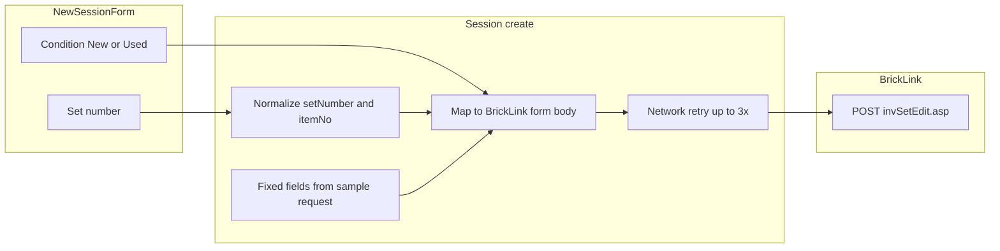

# New session

**Status:** Draft — for Dave review  
**Last updated:** 2026-06-11

---

## Overview

| Field | Value |
|-------|-------|
| **View name** | New session |
| **Route** | `/session/new` |
| **Route params** | — |
| **Query params** | — |
| **Primary actor(s)** | Session lead |
| **Delivery unit** | 0 (fixture) → 1 (live create + Bricklink fetch) |
| **Source file** | [`src/views/NewSessionView.vue`](../../src/views/NewSessionView.vue) |

## Related docs

- [Product Spec — Application views](../../feature/part-out-coordinator/product-spec.md#application-views)
- [Product Spec — Scenario 2: New session](../../feature/part-out-coordinator/product-spec.md#key-scenarios)
- [Tech Spec — Sessions & part-out fetch](../../feature/part-out-coordinator/tech-spec.md#sessions-unit-1)
- [Planned views & services — New session](../support/planned-views-services.md#2-new-session)
- [Storyboard walkthrough § 2. New session](../support/storyboard.md#2-new-session)
- [Shared chrome](./README.md#shared-chrome)
- [ADR-0004 — Part-out server fetch](../../adr/0004-part-out-server-fetch-curated-import.md)
- [Set part-out list — request capture](../support/set-part-out-list/request.md) — canonical `curl` and fixed form values
- [BrickLink set part-out fetch](../bricklink-set-part-out-fetch.md) — server mapping contract

## Purpose

Session lead specifies the LEGO **set number** and **condition** (New or Used), then submits so the coordinator fetches the official part-out list and creates a session in the **importing** phase. Pricing and inventory-merge behavior use **fixed BrickLink wizard defaults** from the sample request — they are not exposed in this form.

## Locked decisions

| Topic | Decision |
|-------|----------|
| Form scope | **Set number + condition only** in the SPA; pricing and inventory merge are server-side constants from [request.md](../support/set-part-out-list/request.md). |
| Condition | **New** or **Used** only — no Mixed. Partial-bag two-sweep uses **two separate sessions** ([lot-form.md](./lot-form.md)). |
| Default condition | **None** — lead must explicitly select New or Used before submit. |
| Set number storage | Trim whitespace; **auto-append `-1`** when the user omits a variant suffix (e.g. `70404` → `70404-1`). Persist canonical `{base}-{variant}` on the session record. |
| Set number → BrickLink `itemNo` | Strip the variant suffix for the upstream POST (e.g. `70404-1` → `70404`), matching the canonical sample (`itemNo=21306` in [request.md](../support/set-part-out-list/request.md)). |
| Session name | Derived: `{normalizedSetNumber} part-out` (uses stored form with `-1` suffix). |
| `partOutOptions` (persisted) | **Condition only** (`new` \| `used`). Pricing and overwrite are not stored — fixed at fetch time. |
| Display name | Set on **Home** only. If `workerDisplayName` is missing from `sessionStorage`, **block submit** with the same destructive alert copy as Home (“Enter your display name first”) and a path back to `/`. No editable name field on this view; no silent `"Session Lead"` fallback. |
| Fetch failure — invalid set | BrickLink rejects or returns an unparseable part-out for the set → **no session created**; destructive alert on this view; user stays on New session to correct input. |
| Fetch failure — network | Server **retries the BrickLink POST up to 3 times** during `POST /api/v1/sessions`. If all retries fail, session **is created** in `importing` with `part_out_fetch_status=error`; client navigates to Part-out import for refetch ([part-out-import.md](./part-out-import.md)). |
| Shell chrome | Renders inside [`AppShell`](../../src/components/AppShell.vue) (header + storyboard badge in fixture mode). **SessionNav is hidden** — no `sessionId` in route until after create. |

## Entry & exit

### How users arrive

| From | Path / action |
|------|---------------|
| Home → **Create new session** | `/session/new` (requires normalized `workerDisplayName` in `sessionStorage`) |
| Direct navigation / bookmark | `/session/new` — submit blocked until lead returns to Home and enters a display name |

### Where actions navigate

| Action | Destination |
|--------|-------------|
| **Create session & fetch part-out** (success) | `/session/:sessionId/import` |
| Invalid set number on create (live) | Stay on `/session/new` — no session created |
| Network fetch exhausted after retries (live) | `/session/:sessionId/import` — session exists with fetch error; refetch on import view |

## Layout & controls

### Target (Unit 1+)

| Element | Copy / behavior |
|---------|-----------------|
| Page heading | New session |
| Helper text (live) | Set number and condition (New or Used). Pricing and inventory merge use fixed BrickLink defaults. |
| Display name hint (when missing) | Destructive alert: Enter your display name first — link or instruction to return to Home |
| Label | Set number |
| Input placeholder | 70404-1 |
| Prefill set number | `70404-1` (editable) |
| **Condition** (radio) | New · Used — **no default selected** |
| Submit button | Create session & fetch part-out — disabled while request in flight |

### Storyboard (Unit 0 today)

Legacy UI in [`NewSessionView.vue`](../../src/views/NewSessionView.vue) still shows pricing basis, condition mix (including **Mixed**), and existing-lots option groups. Helper text: “Set number and Bricklink part-out options. Server fetch is simulated in storyboard.” Defaults from [`app-preferences.json`](../../config/app-preferences.json) pre-select condition `mixed` — **not** target behavior.

| Element | Copy / behavior (Unit 0 only) |
|---------|-------------------------------|
| Label | Pricing basis |
| Radio | Stock guide · Last 6 months sales |
| Label | Condition mix |
| Radio | New · Used · **Mixed** |
| Label | Existing lots |
| Radio | Consolidate with existing · Overwrite existing |
| Helper text | Server fetch is simulated in storyboard. |

### BrickLink part-out request mapping

The server POSTs to `invSetEdit.asp` on create. Only **set number** and **condition** come from this form; all other form fields match the canonical sample in [request.md](../support/set-part-out-list/request.md). Implementation details: [bricklink-set-part-out-fetch.md](../bricklink-set-part-out-fetch.md).

#### User inputs

| UI field | Stored value | BrickLink field |
|----------|--------------|-----------------|
| Set number | `setNumber` (canonical `{base}-{variant}`, e.g. `70404-1`) | `itemNo` (bare set id, e.g. `70404` — strip `-1` suffix) |
| Condition: New | `new` | `itemCondition=N` |
| Condition: Used | `used` | `itemCondition=U` |

Session-wide lot condition drives the read-only label on Lot form.

#### Fixed BrickLink parameters (not user-configurable)

These values are server-side constants on create, taken from the sample `--data-raw` in [request.md](../support/set-part-out-list/request.md):

| Field | Value | Notes |
|-------|-------|-------|
| `itemType` | `S` | |
| `itemSeq` | `1` | |
| `itemQty` | `1` | |
| `breakType` | `M` | |
| `breakSets` | `Y` | |
| `itemPrice` | `I` | Inventory pricing per canonical sample — not user-selectable in MVP |
| `itemRound` | `2` | |
| `itemBulk` | `1` | |
| `itemDesc` | *(empty)* | |
| `itemRemarks` | *(empty)* | |
| `invDup` | `Y` | |
| `invAdjustPrice` | `N` | |
| `invAdjustBulk` | `O` | |
| `invAdjustSale` | `O` | |
| `invAdjustRemarks` | `N` | |
| `invAdjustExtended` | `O` | |
| `invAdjustStock` | `O` | |
| `invAdjustRetain` | `O` | |
| `invAdjustCost` | `O` | |
| `invAdjustWeight` | `O` | |
| `ItemInvSort` | `1` | |
| `ItemInvAsc` | `A` | |
| `TQ1`–`TS3` | *(empty)* | |
| `sellerOptionCost`, `sellerOptionMyWeight`, `sellerOptionStock` | *(empty)* | |

**Pricing** (`itemPrice`, `itemRound`, `itemBulk`) and **lot consolidation / duplicate inventory** (`invDup`, `invAdjust*`) are **not** exposed in the SPA; the server always sends these values when POSTing `invSetEdit.asp`.



## Validation & normalization

| Field | Rule |
|-------|------|
| Set number | Trim; block empty submit; auto-append `-1` on blur or submit when no `-` suffix present |
| Condition | Required before submit; inline destructive alert if neither New nor Used selected |
| Display name | Read `workerDisplayName` from `sessionStorage` (set on Home); block submit with Home copy if missing |

## Submit & loading (Unit 1+)

| State | Behavior |
|-------|----------|
| Idle | Submit enabled when display name present, set number non-empty, condition selected |
| In flight | Submit disabled; optional inline “Fetching part-out…” helper |
| Invalid set | Stay on view; show server error message; **no** navigation |
| Network exhausted | Navigate to import view; session persisted with `part_out_fetch_status=error` |
| Success | Store client session keys (see [Client state](#client-state)); navigate to import |

Server performs network retries (up to 3) — not the browser client.

## Messages & feedback

### Unit 0 (fixture)

| Message | Type | Trigger |
|---------|------|---------|
| Set number and Bricklink part-out options. Server fetch is simulated in storyboard. | Helper text | Always |
| *(none)* | — | No condition-required or display-name validation in storyboard today |

### Unit 1+ (live)

| Message | Type | Trigger |
|---------|------|---------|
| Set number and condition (New or Used). Pricing and inventory merge use fixed BrickLink defaults. | Helper text | Always |
| Enter your display name first | Destructive alert | Submit with missing `workerDisplayName` |
| Select New or Used condition | Destructive alert / inline | Submit with no condition selected |
| Fetching part-out… | Helper text / disabled submit | Create request in flight |
| {server message} | Destructive alert | Invalid set — fetch rejected; stay on view |
| *(import view)* | Alert + refetch | Network failure after retries — see [part-out-import.md](./part-out-import.md) |

## User actions

| Action | Preconditions | Outcome |
|--------|---------------|---------|
| Configure set number | — | Updates form state; normalizes on blur/submit |
| Select condition (New or Used) | — | Stored in `partOutOptions.condition` on create |
| Create session & fetch part-out | Non-empty `workerDisplayName` in `sessionStorage`; non-empty set number; condition selected | Creates session (phase `importing`), sets current worker as lead, persists client keys, navigates to Part-out import on success |

## Client state

| When | `sessionStorage` keys | In-memory (`useSession`) |
|------|----------------------|--------------------------|
| Arrive from Home | `workerDisplayName` (normalized) | — |
| Create success (Unit 1+) | `workerDisplayName`, `currentSessionId`, `currentWorkerId` | `setCurrentWorker(worker)` |

Unit 1+: connect `useWebSocket` after successful create (before navigation to import). Display name is not persisted server-side until `POST /api/v1/sessions`.

## Data requirements

### Read

| Field / entity | Source (live) | Notes |
|----------------|---------------|-------|
| Worker display name | Client `sessionStorage` | From Home — required for submit |

### Write

| Operation | Endpoint (live) | Notes |
|-----------|-----------------|-------|
| Create session + fetch part-out | `POST /api/v1/sessions` | See [API contract](#api-contract) |

### API contract

**Request:**

```json
{
  "setNumber": "70404-1",
  "displayName": "Alex",
  "partOutOptions": { "condition": "used" }
}
```

**Response (success or partial success):**

```json
{
  "sessionId": "…",
  "partOutFetchStatus": "ok",
  "partOutFetchError": null,
  "worker": { "id": "…", "displayName": "Alex" }
}
```

**Response when invalid set (HTTP 4xx):** `{ "error": { "code": "…", "message": "…" } }` — no session created.

Server-side on create: normalize `setNumber`, map to BrickLink form (`itemNo` without suffix, `itemCondition`, fixed fields), retry BrickLink POST up to 3 times on transient failure, parse HTML → `part_out_lines`.

`partOutOptions` on the persisted session record carries **condition only** (`new` \| `used`).

## Acceptance criteria

- [ ] Lead can enter a Bricklink set number (e.g. `70404` or `70404-1`; stored as `70404-1`)
- [ ] Lead must explicitly choose **condition** (`New` or `Used`) — no pre-selected default
- [ ] Submit blocked without display name from Home (no silent fallback name)
- [ ] Form does **not** expose pricing or existing-lot options (Unit 1+)
- [ ] Server fetch uses fixed pricing/consolidation values from [request.md](../support/set-part-out-list/request.md)
- [ ] BrickLink `itemNo` uses bare set id (variant suffix stripped)
- [ ] Submit creates a session and navigates to Part-out import on fetch success
- [ ] Fetched part-out lines are available on the import view (fixture or live)
- [ ] Condition (`new` or `used`) is persisted on the session and drives read-only lot form label
- [ ] Invalid set: error on New session; no session record created
- [ ] Network failure after 3 retries: session created with error status; import view shows refetch
- [ ] SessionNav is **not** shown (no `sessionId` until after create)

## Storyboard status

### Implemented (Unit 0)

- Form with set number, condition, pricing, existing-lots, and legacy Mixed radio (see [Storyboard layout](#storyboard-unit-0-today))
- Simulated create → fixture demo part-out lines cloned into new session
- Phase set to `importing`; confirm on import advances to `counting`
- Default set `70404-1`; default condition `mixed` in config (legacy)

### Gaps (Units 1–4)

- Remove pricing basis, existing-lots, and Mixed condition from UI
- No default condition; condition-required validation
- Display-name required validation (match Home)
- Set-number normalization (auto-append `-1`; strip for BrickLink)
- Live `POST /api/v1/sessions` with server-side fetch retry
- Invalid-set vs network failure UX
- Replace storyboard helper text in live mode

### `data-testid` inventory

| Test id | Element | Unit |
|---------|---------|------|
| `new-session-view` | Page container | 0+ |
| `set-number` | Set number input | 0+ |
| `condition-new` | New condition radio | 1+ |
| `condition-used` | Used condition radio | 1+ |
| `condition-required-error` | Condition validation alert | 1+ |
| `display-name-required-error` | Display name validation alert | 1+ |
| `submit-new-session` | Submit button | 0+ |

## Open questions

- Show fetch progress / line count after create (beyond disabled submit + helper text)?
