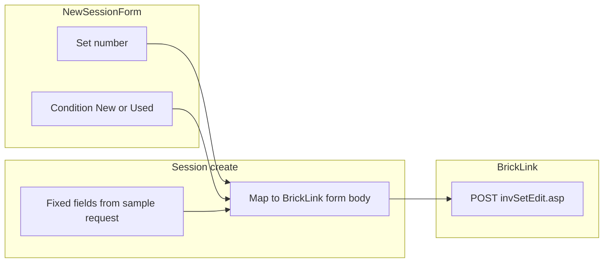

# New session

**Status:** Draft — for Dave review  
**Last updated:** 2026-06-11

---

## Overview

| Field | Value |
|-------|-------|
| **View name** | New session |
| **Route** | `/session/new` |
| **Route params** | — |
| **Query params** | — |
| **Primary actor(s)** | Session lead |
| **Delivery unit** | 0 (fixture) → 1 (live create + Bricklink fetch) |
| **Source file** | [`src/views/NewSessionView.vue`](../../src/views/NewSessionView.vue) |

## Related docs

- [Product Spec — Application views](../../feature/part-out-coordinator/product-spec.md#application-views)
- [Product Spec — Scenario 2: New session](../../feature/part-out-coordinator/product-spec.md#key-scenarios)
- [Planned views & services — New session](../support/planned-views-services.md#2-new-session)
- [Storyboard walkthrough § 2. New session](../support/storyboard.md#2-new-session)
- [ADR-0004 — Part-out server fetch](../../adr/0004-part-out-server-fetch-curated-import.md)
- [Set part-out list — request capture](../support/set-part-out-list/request.md) — canonical `curl` and fixed form values
- [BrickLink set part-out fetch](../bricklink-set-part-out-fetch.md) — server mapping contract

## Purpose

Session lead specifies the LEGO **set number** and **condition** (New or Used), then submits so the coordinator fetches the official part-out list and creates a session in the **importing** phase. Pricing and inventory-merge behavior use **fixed BrickLink wizard defaults** from the sample request — they are not exposed in this form.

## Entry & exit

### How users arrive

| From | Path / action |
|------|---------------|
| Home → **Create new session** | `/session/new` |
| Direct navigation | `/session/new` (requires display name in `sessionStorage` from Home) |

### Where actions navigate

| Action | Destination |
|--------|-------------|
| **Create session & fetch part-out** (success) | `/session/:sessionId/import` |
| Fetch failure (live, planned) | Stay on view or redirect to import with error — see Tech Spec |

## Layout & controls

| Element | Copy / behavior |
|---------|-----------------|
| Page heading | New session |
| Helper text (storyboard) | Set number and condition (New or Used). Pricing and inventory merge use fixed BrickLink defaults. Server fetch is simulated in storyboard. |
| Label | Set number |
| Input placeholder | 70404-1 |
| Default set number | `70404-1` |
| **Condition** (radio) | New · Used |
| Submit button | Create session & fetch part-out |

### BrickLink part-out request mapping

The server POSTs to `invSetEdit.asp` on create. Only **set number** and **condition** come from this form; all other form fields match the canonical sample in [request.md](../support/set-part-out-list/request.md). Implementation details: [bricklink-set-part-out-fetch.md](../bricklink-set-part-out-fetch.md).

#### User inputs

| UI field | Stored value | BrickLink field |
|----------|--------------|-----------------|
| Set number | `setNumber` | `itemNo` (normalize `-1` suffix per open question below) |
| Condition: New | `new` | `itemCondition=N` |
| Condition: Used | `used` | `itemCondition=U` |

Session-wide lot condition (all lots in this session are New or Used) drives the read-only label on Lot form. Partial-bag two-sweep work uses **two separate sessions** (one New, one Used), not a Mixed option here.

#### Fixed BrickLink parameters (not user-configurable)

These values are server-side constants on create, taken from the sample `--data-raw` in [request.md](../support/set-part-out-list/request.md):

| Field | Value |
|-------|-------|
| `itemType` | `S` |
| `itemSeq` | `1` |
| `itemQty` | `1` |
| `breakType` | `M` |
| `breakSets` | `Y` |
| `itemPrice` | `I` |
| `itemRound` | `2` |
| `itemBulk` | `1` |
| `itemDesc` | *(empty)* |
| `itemRemarks` | *(empty)* |
| `invDup` | `Y` |
| `invAdjustPrice` | `N` |
| `invAdjustBulk` | `O` |
| `invAdjustSale` | `O` |
| `invAdjustRemarks` | `N` |
| `invAdjustExtended` | `O` |
| `invAdjustStock` | `O` |
| `invAdjustRetain` | `O` |
| `invAdjustCost` | `O` |
| `invAdjustWeight` | `O` |
| `ItemInvSort` | `1` |
| `ItemInvAsc` | `A` |
| `TQ1`–`TS3` | *(empty)* |
| `sellerOptionCost`, `sellerOptionMyWeight`, `sellerOptionStock` | *(empty)* |

**Pricing** (`itemPrice`, `itemRound`, `itemBulk`) and **lot consolidation / duplicate inventory** (`invDup`, `invAdjust*`) are **not** exposed in the SPA; the server always sends these values when POSTing `invSetEdit.asp`.

## Messages & feedback

| Message | Type | Trigger |
|---------|------|---------|
| Server fetch is simulated in storyboard. | Helper text | Always visible in Unit 0 |
| Fetch error message (planned) | Alert | Live: Bricklink fetch fails on create |
| Loading state (planned) | Inline / disabled submit | Live: fetch in progress |

No validation errors are shown today for empty or invalid set numbers.

## User actions

| Action | Preconditions | Outcome |
|--------|---------------|---------|
| Configure set number | — | Updates form state |
| Select condition (New or Used) | — | Stored in `partOutOptions.condition` on create |
| Create session & fetch part-out | Display name from Home (fallback: "Session Lead") | Creates session (phase `importing`), sets current worker as lead, navigates to Part-out import |

## Data requirements

### Read

| Field / entity | Source (live) | Notes |
|----------------|---------------|-------|
| Worker display name | Client `sessionStorage` | From Home |

### Write

| Operation | Endpoint (live) | Notes |
|-----------|-----------------|-------|
| Create session + fetch part-out | `POST /api/v1/sessions` | **From client:** set number, `partOutOptions.condition` (`new` \| `used`), lead display name. **Server-side:** full BrickLink form body (fixed fields above + mapped `itemNo` / `itemCondition`). Server fetches Bricklink part-out, persists `part_out_lines`. Returns `sessionId`, `part_out_fetch_status`. |

Session name is derived from set number (e.g. `{setNumber} part-out`).

`partOutOptions` on the persisted session record carries **condition only** (`new` \| `used`). Legacy storyboard fixtures may still include `pricing` and `overwrite` until `/build` aligns the UI and session shape.

## Acceptance criteria

- [ ] Lead can enter a Bricklink set number (e.g. `70404-1`)
- [ ] Lead can choose **condition** (`New` or `Used` only)
- [ ] Form does **not** expose pricing or existing-lot options
- [ ] Server fetch uses fixed pricing/consolidation values from [request.md](../support/set-part-out-list/request.md)
- [ ] Submit creates a session and navigates to Part-out import
- [ ] Fetched part-out lines are available on the import view (fixture or live)
- [ ] Condition (`new` or `used`) is persisted on the session and drives read-only lot form label
- [ ] Live: fetch failure shows actionable error without losing the session record
- [ ] SessionNav is **not** shown (no `sessionId` until after create)

## Storyboard status

### Implemented (Unit 0)

- Form with set number, condition, pricing, existing-lots, and legacy Mixed radio — **spec now targets set number + condition only**; legacy controls remain in storyboard UI pending `/build`
- Simulated create → fixture demo part-out lines cloned into new session
- Phase set to `importing`; confirm on import advances to `counting`
- Default set `70404-1`

### Gaps (Units 1–4)

- Remove pricing basis and existing-lots option groups from UI (not user-configurable per spec)
- Remove **Mixed** condition option; default condition should be `new` or `used`, not `mixed` ([`app-preferences.json`](../../config/app-preferences.json) still defaults `mixed`)
- No live `POST /api/v1/sessions` or Bricklink fetch
- No set-number validation or fetch error UI
- No refetch path from this view
- Helper text about simulation should be removed or replaced in live mode

### `data-testid` inventory

| Test id | Element |
|---------|---------|
| `new-session-view` | Page container |
| `set-number` | Set number input |
| `submit-new-session` | Submit button |

## Open questions

- Required set number format validation (e.g. must include `-1` suffix)?
- Should lead display name be editable here if they skipped Home?
- Show fetch progress / line count after create?
