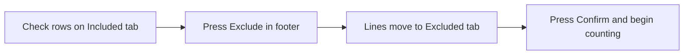

# Part-out import

**Status:** Draft — for Dave review  
**Last updated:** 2026-06-11

---

## Overview

| Field | Value |
|-------|-------|
| **View name** | Part-out import |
| **Route** | `/session/:sessionId/import` |
| **Route params** | `sessionId` |
| **Query params** | — |
| **Primary actor(s)** | Session lead |
| **Delivery unit** | 0 (fixture table) → 1 (live curation) |
| **Source file** | [`src/views/PartOutImportView.vue`](../../src/views/PartOutImportView.vue) |
| **Child component** | [`PartOutImportTable.vue`](../../src/components/PartOutImportTable.vue) |

## Related docs

- [Product Spec — Application views](../../feature/part-out-coordinator/product-spec.md#application-views)
- [Product Spec — Scenario 3: Curate import](../../feature/part-out-coordinator/product-spec.md#key-scenarios)
- [Planned views & services — Part-out import](../support/planned-views-services.md#3-part-out-import)
- [Storyboard walkthrough § 3. Part-out import](../support/storyboard.md#3-part-out-import)
- [BrickLink set part-out fetch](../bricklink-set-part-out-fetch.md) — row parse targets including part image
- [Shared chrome](./README.md#shared-chrome)

## Purpose

Session lead reviews the server-fetched Bricklink part-out list and curates counting scope before workers begin. Curation uses **row checkboxes** and a footer **Exclude** button — not per-row exclude actions. Most sessions confirm the full list unchanged; partial-bag sets may exclude out-of-scope lines per sweep.

## Entry & exit

### How users arrive

| From | Path / action |
|------|---------------|
| New session → submit | `/session/:sessionId/import` |
| Return to curate before counting (planned) | Same route while phase is `importing` |

### Where actions navigate

| Action | Destination |
|--------|-------------|
| **Confirm & begin counting** | `/session/:sessionId/cups` |
| SessionNav | Other session views (Cups, Lot, etc.) |

## Layout & controls

### View shell

| Element | Copy / behavior |
|---------|-----------------|
| Page heading | {session.name} |
| Helper text | Curate the fetched part-out list before counting begins. |
| Footer actions | **Exclude** (secondary/outline) · **Confirm & begin counting** (primary) — siblings in one row |
| **Exclude** button | Excludes all **checked** rows on the **Included** tab; disabled when no rows selected or when Excluded tab is active |
| Primary button | Confirm & begin counting |

### Part-out import table

| Element | Copy / behavior |
|---------|-----------------|
| Section heading | Part-out import |
| Tab | Included ({count}) |
| Tab | Excluded ({count}) |
| **Included table columns** | (checkbox), Thumbnail, Part, Color, Cond, Qty, Remarks |
| **Excluded table columns** | Thumbnail, Part, Color, Qty, Remarks, Restore |
| Row action (included) | *(none — no per-row Exclude)* |
| Row action (excluded) | Restore |

#### Thumbnail

| Aspect | Spec |
|--------|------|
| Content | Small LEGO part image for the row's part + color |
| Placement | First data column after checkbox (Included) or leading column (Excluded) |
| Alt text | Part id (e.g. `3001`) for accessibility |
| Fallback | Placeholder or broken-image treatment when URL missing (storyboard may use static fixture URLs) |
| Data source | Prefer image URL from BrickLink part-out HTML parse (`a[id^="imgLink"]` per [bricklink-set-part-out-fetch.md](../bricklink-set-part-out-fetch.md)); expose as `thumbnailUrl` on line payload or derive at render — implementation detail for `/build` |

### Curation workflow

- Default path: no checks → **Confirm** full list.
- Partial-bag: check out-of-scope lines → **Exclude** → optionally **Restore** from Excluded tab → **Confirm**.

## Messages & feedback

| Message | Type | Trigger |
|---------|------|---------|
| Curate the fetched part-out list before counting begins. | Helper text | Always |
| Tab counts Included (N) / Excluded (N) | Tab labels | Reflects current curation state |
| Fetch error / refetch (planned) | Alert + action | Live: part-out fetch failed or stale |

No confirmation dialog before **Confirm & begin counting**.

## User actions

| Action | Preconditions | Outcome |
|--------|---------------|---------|
| Check / uncheck row | Included tab | Toggles row in selection set |
| **Exclude** (footer) | Included tab; one or more rows checked | Checked lines move to Excluded; selection cleared |
| Restore line | Excluded tab | Line returns to Included |
| Confirm & begin counting | At least zero included lines (no minimum enforced today) | Session phase → `counting`; navigate to List cups |

Footer **Exclude** maps to `POST …/part-out/lines/bulk-exclude` (or equivalent batch PATCH) in live mode.

### Curation scenarios (product)

| Scenario | Lead behavior |
|----------|---------------|
| Brand-new sealed set | Confirm full list — all lines included |
| Loose brick purchase | Confirm full list — all lines included |
| Partial-bag / two-sweep | Check and **Exclude** lines out of scope for this sweep; second session excludes the opposite subset |

## Data requirements

### Read

| Field / entity | Source (live) | Notes |
|----------------|---------------|-------|
| Session | `GET /api/v1/sessions/:id` | Phase, fetch status |
| Part-out lines | `GET /api/v1/sessions/:id/part-out/lines` | partId, colorId, condition, qtyExpected, remarks, excluded flag, `thumbnailUrl` (optional) |

### Write

| Operation | Endpoint (live) | Notes |
|-----------|-----------------|-------|
| Bulk exclude (footer) | `POST …/part-out/lines/bulk-exclude` | Body: `{ lineIds: [] }` — checked Included rows |
| Restore line | `PATCH …/part-out/lines/:lineId` `{ excluded: false }` | |
| Confirm import | `POST …/part-out/confirm` | Phase → `counting`; WebSocket `session.phase` |
| Refetch (planned) | `POST …/part-out/refetch` | On fetch failure |

## Acceptance criteria

- [ ] All fetched part-out lines visible with thumbnail, part, color, condition, qty, and Remarks
- [ ] Each included and excluded row shows a part **thumbnail**
- [ ] Included rows have **no** per-row Exclude control
- [ ] Footer **Exclude** sits beside **Confirm & begin counting**
- [ ] Lead can check rows on Included tab and press **Exclude** to move them to Excluded
- [ ] Lead can restore excluded lines from the Excluded tab
- [ ] Tab counts update when lines move between Included and Excluded
- [ ] **Confirm & begin counting** advances session to counting phase and opens List cups
- [ ] Excluded lines are omitted from reconciliation comparison (included lines only)
- [ ] Single-sweep workflow: confirm without exclusions works for new/loose sessions
- [ ] Two-sweep workflow: lead can check and exclude out-of-scope lines before confirm

## Storyboard status

### Implemented (Unit 0)

- Full included/excluded tabs with counts
- Per-row exclude, table-header bulk exclude, and restore — **spec now targets checkbox + footer Exclude and thumbnails**; legacy controls remain in storyboard UI pending `/build`
- Confirm advances phase and navigates to List cups
- Fixture in-memory line mutations

### Gaps (Units 1–4)

- Part thumbnails on import rows
- Move **Exclude** to footer beside Confirm; remove per-row and table-header bulk exclude
- No live part-out fetch or refetch-on-error
- No fetch status indicator on mount
- No guard preventing confirm with zero included lines (if product requires)
- No Remarks-driven filtering or search

### `data-testid` inventory

| Test id | Element |
|---------|---------|
| `part-out-import-view` | Page container |
| `confirm-import` | Confirm button |
| `exclude-import` | Footer Exclude button |
| `part-out-import-table` | Table component root |
| `part-out-row-thumbnail` | Row thumbnail (or per-row suffix) |
| `tab-included` | Included tab |
| `tab-excluded` | Excluded tab |

`bulk-exclude` (table header) is deprecated — spec targets `exclude-import` in the view footer.

## Open questions

- Minimum included lines required before confirm?
- Should excluded lines show condition column in Excluded tab (currently omitted)?
- Refetch UX when Bricklink fetch fails on create?
- Thumbnail size / aspect ratio on mobile?
- Should footer **Exclude** show selected count in label (e.g. `Exclude (3)`)?
