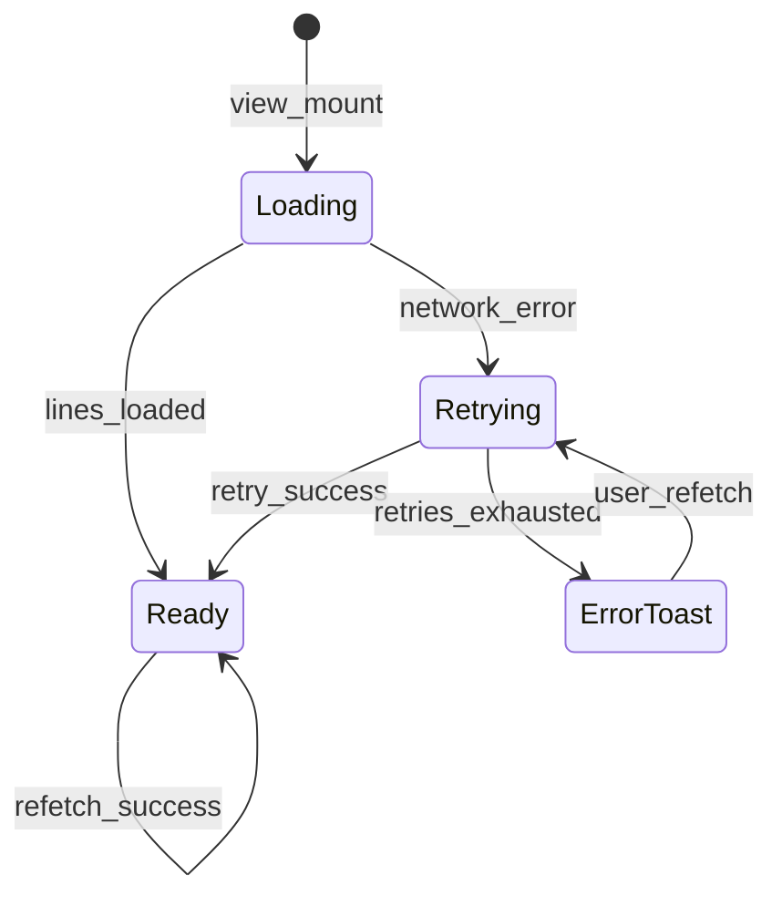
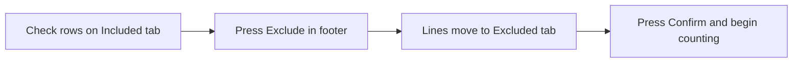

# Part-out import

**Status:** Draft — for Dave review  
**Last updated:** 2026-06-11

---

## Overview

| Field | Value |
|-------|-------|
| **View name** | Part-out import |
| **Route** | `/session/:sessionId/import` |
| **Route params** | `sessionId` |
| **Query params** | — |
| **Primary actor(s)** | Any joined worker |
| **Delivery unit** | 0 (fixture table) → 1 (live curation) |
| **Source file** | [`src/views/PartOutImportView.vue`](../../src/views/PartOutImportView.vue) |
| **Child component** | [`PartOutImportTable.vue`](../../src/components/PartOutImportTable.vue) |

## Related docs

- [Product Spec — Application views](../../feature/part-out-coordinator/product-spec.md#application-views)
- [Product Spec — Scenario 3: Curate import](../../feature/part-out-coordinator/product-spec.md#key-scenarios)
- [Planned views & services — Part-out import](../support/planned-views-services.md#3-part-out-import)
- [Storyboard walkthrough § 3. Part-out import](../support/storyboard.md#3-part-out-import)
- [BrickLink set part-out fetch](../bricklink-set-part-out-fetch.md) — row parse targets including part image and description
- [New session — fetch failure (network)](./new-session.md#submit-outcomes-unit-1) — navigate here with `partOutFetchStatus=error`
- [Shared chrome — SessionNav during importing](./README.md#sessionnav-bottom-bar)
- [Home — Toast notifications](./home.md#toast-notifications)

## Purpose

Any joined worker reviews the server-fetched Bricklink part-out list and curates counting scope before the session advances to counting. Curation uses **row checkboxes**, an Included-tab **select-all** checkbox, and a footer **Exclude** button — not per-row exclude actions. Most sessions confirm the full list unchanged; partial-bag sets may exclude out-of-scope lines per sweep. Session **condition (New or Used)** is shown prominently so workers know which sweep this session represents.

## Entry & exit

### How users arrive

| From | Path / action |
|------|---------------|
| New session → submit | `/session/:sessionId/import` — including when create returned `partOutFetchStatus=error` ([new-session.md](./new-session.md#submit-outcomes-unit-1)) |
| Join existing session (`importing` phase) | `/session/:sessionId/import` ([home.md — Post-join routing](./home.md#post-join-routing)) |

While `phase === 'importing'`, this view is the **only** session-scoped screen — [`SessionNav`](./README.md#sessionnav-bottom-bar) is hidden.

### Where actions navigate

| Action | Destination |
|--------|-------------|
| **Confirm & begin counting** | `/session/:sessionId/lot` (Lot form) |
| After confirm | SessionNav becomes visible; other session views reachable |

## Layout & controls

### View shell

| Element | Copy / behavior |
|---------|-----------------|
| Page heading | {session.name} |
| Session context | Set number + condition (New/Used) — see [Session context](#session-context) |
| Helper text | Curate the fetched part-out list before counting begins. |
| Loading indicator | Spinner while lines load or network retry is in progress — see [Loading & fetch states](#loading--fetch-states) |
| Footer actions | **Exclude** (secondary/outline) · **Confirm & begin counting** (primary) — siblings in one row |
| **Exclude** button | Label **Exclude** only (no selected count). Excludes all **checked** rows on the **Included** tab. **Disabled** when no row checkbox is checked, when the Excluded tab is active, or while footer buttons are disabled per fetch state. |
| **Confirm & begin counting** | **Disabled** while no lines are loaded or when included count is 0. Enabled when at least one line is included. |

### Session context

Read-only strip below the page heading (`data-testid="session-import-context"`):

| Element | Source | Display |
|---------|--------|---------|
| Set number | `GET /api/v1/sessions/:id` → `setNumber` | e.g. `70404-1` |
| Condition | `partOutOptions.condition` | **New** or **Used** (human label) |
| Fetch status | `part_out_fetch_status` | Drives [Loading & fetch states](#loading--fetch-states); no separate badge required for MVP |

### Loading & fetch states

On mount (and on manual refetch), load part-out lines from `GET /api/v1/sessions/:id/part-out/lines`. Show a spinner (`data-testid="import-loading-spinner"`) during load and during automatic network retries (up to **3 attempts**, aligned with [new-session.md](./new-session.md)).

| State | UI | Exclude + Confirm |
|-------|-----|-------------------|
| **Loading** | Spinner + “Loading part-out…” (or equivalent) | **Disabled** |
| **Retrying** (network, ≤3 attempts) | Spinner + retry hint | **Disabled** |
| **Ready** (≥1 line in payload) | Table populated | Exclude per checkbox rules; Confirm enabled only if **included count ≥ 1** |
| **Error** (non-network or retries exhausted) | Empty table + **Refetch** button (`data-testid="refetch-part-out"`) | **Disabled** until refetch succeeds |
| **All excluded** (lines exist, included count 0) | Tabs populated; Included tab empty | Confirm **disabled**; toast on confirm attempt |

**Refetch:** No confirmation dialog before refetch. Server retries Bricklink POST up to 3× on network errors. On success, **existing exclusions are preserved** (merge by stable line identity — server line id or partId + colorId + condition + remarks). Non-network failures after retries → toast with server message.

### Part-out import table

| Element | Copy / behavior |
|---------|-----------------|
| Section heading | Part-out import |
| Tab | Included ({count}) |
| Tab | Excluded ({count}) |
| **Included table columns** | (select-all checkbox), (row checkbox), Thumbnail, Part, Color, Cond, Qty, Remarks |
| **Excluded table columns** | Thumbnail, Part, Color, Cond, Qty, Remarks, Restore |
| Excluded tab toolbar | **Restore all** (`data-testid="restore-all-excluded"`) when excluded count > 0 — opens confirmation dialog before bulk restore |
| Row action (included) | *(none — no per-row Exclude)* |
| Row action (excluded) | Restore (per row) |

#### Part column

| Aspect | Spec |
|--------|------|
| Content | **Part id** primary (e.g. `3001`) + **description** secondary (BrickLink label, e.g. “Brick 2×4”) |
| Layout | Stacked or two-line cell; truncate description on narrow viewports |
| Data source | `partId` + `description` (or `partDescription`) on line payload from parse |

#### Thumbnail

| Aspect | Spec |
|--------|------|
| Content | Small LEGO part image for the row's part + color |
| Placement | First data column after checkbox (Included) or leading column (Excluded) |
| Alt text | Part id (e.g. `3001`) for accessibility |
| Fallback | Placeholder or broken-image treatment when URL missing (storyboard may use static fixture URLs) |
| Data source | Prefer image URL from BrickLink part-out HTML parse (`a[id^="imgLink"]` per [bricklink-set-part-out-fetch.md](../bricklink-set-part-out-fetch.md)); expose as `thumbnailUrl` on line payload |

#### Select-all (Included tab)

| Aspect | Spec |
|--------|------|
| Control | Header checkbox (`data-testid="select-all-included"`) |
| Behavior | Checks/unchecks all rows on the Included tab; indeterminate when partially selected |
| Scope | Included tab rows only |

### Curation workflow

- Default path: no checks → **Confirm** full list (included count equals total lines).
- Partial-bag: check out-of-scope lines → **Exclude** → optionally **Restore** or **Restore all** from Excluded tab → **Confirm**.

## Messages & feedback

| Message | Type | Trigger |
|---------|------|---------|
| Curate the fetched part-out list before counting begins. | Helper text | Always (when not loading) |
| Loading part-out… | Helper text / spinner region | Loading or retrying |
| Tab counts Included (N) / Excluded (N) | Tab labels | Reflects current curation state |

### Toast notifications

Follow [home.md — Toast notifications](./home.md#toast-notifications): top-right viewport, readable copy, auto-fade dismiss.

| Toast | Trigger |
|-------|---------|
| At least one part-out line must be included before counting begins. | **Confirm** tapped when included count is 0 |
| {error message} | Non-network fetch/refetch failure after retries exhausted |
| Part-out list restored. | After successful **Restore all** (optional; may omit in MVP) |

### Confirmation dialogs

| Dialog | Trigger | Copy |
|--------|---------|------|
| Restore all | **Restore all** on Excluded tab | “Restore all excluded lines to Included?” — **Cancel** / **Restore all** (`data-testid="restore-all-confirm"`) |

**No** confirmation dialog before **Confirm & begin counting** or before **Refetch**.

## User actions

| Action | Preconditions | Outcome |
|--------|---------------|---------|
| Toggle select-all | Included tab | Checks or unchecks all Included rows |
| Check / uncheck row | Included tab | Toggles row in selection set |
| **Exclude** (footer) | Included tab; ≥1 row checkbox checked; lines loaded | Checked lines move to Excluded; selection cleared |
| Restore line | Excluded tab | Line returns to Included |
| **Restore all** | Excluded tab; excluded count > 0; user confirms dialog | All excluded lines return to Included |
| **Refetch** | Error state (no lines loaded) | Retries fetch (≤3× network); preserves exclusions on success; no pre-refetch dialog |
| Confirm & begin counting | Lines loaded; **included count ≥ 1** | `POST …/part-out/confirm` → phase `counting`; WebSocket `session.phase`; navigate to Lot form; SessionNav visible |

Footer **Exclude** maps to `POST …/part-out/lines/bulk-exclude` in live mode. **Restore all** maps to `POST …/part-out/lines/bulk-restore` (or equivalent batch PATCH).

### Curation scenarios (product)

| Scenario | Worker behavior |
|----------|-----------------|
| Brand-new sealed set | Confirm full list — all lines included |
| Loose brick purchase | Confirm full list — all lines included |
| Partial-bag / two-sweep | Check and **Exclude** lines out of scope for this sweep; second session (opposite condition) excludes the opposite subset |

## Data requirements

### Read

| Field / entity | Source (live) | Notes |
|----------------|---------------|-------|
| Session | `GET /api/v1/sessions/:id` | `setNumber`, `partOutOptions.condition`, phase, `part_out_fetch_status` |
| Part-out lines | `GET /api/v1/sessions/:id/part-out/lines` | `partId`, `description`, `colorId`, `condition`, `qtyExpected`, `remarks`, `excluded`, `thumbnailUrl` (optional) |

### Write

| Operation | Endpoint (live) | Notes |
|-----------|-----------------|-------|
| Bulk exclude (footer) | `POST …/part-out/lines/bulk-exclude` | Body: `{ lineIds: [] }` — checked Included rows |
| Restore line | `PATCH …/part-out/lines/:lineId` `{ excluded: false }` | |
| Bulk restore all | `POST …/part-out/lines/bulk-restore` | Body `{}` or `{ all: true }` — sets `excluded: false` on all lines for session |
| Confirm import | `POST …/part-out/confirm` | Phase → `counting`; WebSocket `session.phase` |
| Refetch | `POST …/part-out/refetch` | Re-fetch from BrickLink; merge rows; **preserve existing exclusions** |

## Acceptance criteria

- [ ] Set number and session condition (New/Used) visible in session context
- [ ] All fetched part-out lines visible with thumbnail, part id + description, color, condition, qty, and Remarks
- [ ] Each included and excluded row shows a part **thumbnail**
- [ ] Included tab has header **select-all** checkbox
- [ ] Included rows have **no** per-row Exclude control and **no** table-header bulk exclude button
- [ ] Footer **Exclude** sits beside **Confirm & begin counting**; label is **Exclude** only; disabled until ≥1 row checked
- [ ] Worker can check rows on Included tab and press **Exclude** to move them to Excluded
- [ ] Worker can restore excluded lines from the Excluded tab (per row)
- [ ] **Restore all** on Excluded tab shows confirmation dialog and moves all lines to Included
- [ ] Excluded tab includes **Cond** column (parity with Included)
- [ ] Tab counts update when lines move between Included and Excluded
- [ ] SessionNav **hidden** while `phase === 'importing'`; visible after confirm
- [ ] Spinner shown during initial load and network retry (≤3 attempts)
- [ ] **Confirm** disabled when no lines loaded or included count is 0; toast when confirm attempted with zero included
- [ ] **Refetch** available on fetch error; no pre-refetch dialog; exclusions preserved after successful refetch
- [ ] **Confirm & begin counting** advances session to counting phase and opens **Lot form**
- [ ] Excluded lines omitted from reconciliation comparison (included lines only)
- [ ] Single-sweep workflow: confirm without exclusions works for new/loose sessions
- [ ] Two-sweep workflow: worker can select-all or check and exclude out-of-scope lines before confirm

## Storyboard status

### Implemented (Unit 0)

- Full included/excluded tabs with counts
- Per-row exclude, table-header bulk exclude, and restore — **legacy**; spec targets checkbox + footer Exclude, select-all, Restore all, and thumbnails
- Confirm advances phase and navigates to List cups — **spec targets Lot form**
- Fixture in-memory line mutations
- SessionNav visible during import — **spec targets hidden until confirm**

### Gaps (Units 0–1)

- Part thumbnails and part id + description on import rows
- Move **Exclude** to footer beside Confirm; remove per-row and table-header bulk exclude
- Header select-all on Included tab
- **Restore all** with confirmation on Excluded tab
- Session context (set number + condition)
- SessionNav hidden during `importing`
- Spinner during load/retry; refetch on fetch error
- Confirm requires ≥1 included line; toast on invalid confirm
- Confirm navigates to Lot form (not List cups)
- No Remarks-driven filtering or search

### `data-testid` inventory

| Test id | Element |
|---------|---------|
| `part-out-import-view` | Page container |
| `session-import-context` | Set number + condition strip |
| `import-loading-spinner` | Loading / retry spinner |
| `refetch-part-out` | Refetch button (error state) |
| `confirm-import` | Confirm button |
| `exclude-import` | Footer Exclude button |
| `part-out-import-table` | Table component root |
| `select-all-included` | Included tab header checkbox |
| `part-out-row-thumbnail` | Row thumbnail (or per-row suffix) |
| `tab-included` | Included tab |
| `tab-excluded` | Excluded tab |
| `restore-all-excluded` | Restore all button (Excluded tab) |
| `restore-all-confirm` | Restore all dialog confirm button |

`bulk-exclude` (table header) is **deprecated** — spec targets `exclude-import` in the view footer.

## Open questions

- Thumbnail size / aspect ratio on mobile?
- Remarks-driven filtering or search (out of scope for MVP)?
