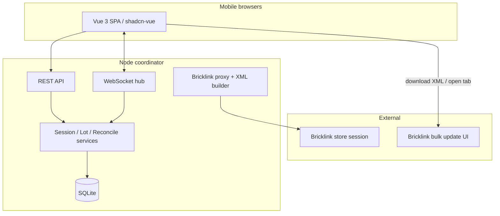

# Tech Spec — Part-Out Counting Coordinator

**AIDLC phase:** Design  
**Grounding:** Implements approved [product-spec.md](./product-spec.md) (Product owner signed off 2026-06-10).

---

## Overview

| Field | Value |
|-------|-------|
| **Feature** | Part-Out Counting Coordinator |
| **Parent issue** | [GitHub #2](https://github.com/dcvezzani/brick-counter-coordinator/issues/2) |
| **Product Spec** | [product-spec.md](./product-spec.md) |
| **Status** | In review — awaiting human approval before `/build` |
| **Author** | AIDLC `/design` (David Vezzani, product owner) |
| **Created** | 2026-06-10 |
| **Last updated** | 2026-06-10 (view/service inventory; review passes; join-name policy) |

### Summary

A **Vue 3 SPA** (shadcn-vue, JavaScript) talks to a **Node.js coordinator** over **REST + WebSockets**. The server owns session state, lot consolidation, reconciliation, pick-list split, and Bricklink-oriented import/export. Work ships in **five Units** (0–4); each Unit gets a **child GitHub issue** on board [#2](https://github.com/users/dcvezzani/projects/2) for Build/Review cycles.

### Units

| Unit | Title | GitHub card (create) | Product criteria |
|------|-------|----------------------|------------------|
| **0** | Storyboard prototype | `Unit 0: Storyboard — all views` | #14, #15 |
| **1** | Shell, fetch & import curation | `Unit 1: Session create/join + Part-out import` | #4 (partial), #14, #16 |
| **2** | Counting & cups | `Unit 2: Lot entry + List cups` | #1–#7, #14 |
| **3** | Organizer pick lists | `Unit 3: List lots organizer` | #10–#12 |
| **4** | Reconciliation & XML export | `Unit 4: Part-out reconciliation` | #8, #9, #13 |

Units **1–4** depend on prior units only sequentially (2 needs 1, 3 needs 2, 4 needs 3). **Unit 0** has no server dependency.

---

## Context

### Existing system & documentation

| Source | Use |
|--------|-----|
| [docs/tech-stack.md](../../docs/tech-stack.md) | Client stack (Vite, shadcn-vue, JS) |
| [application-views.md](../../docs/support/application-views.md) | View names, navigation |
| [storyboard.md](../../docs/support/storyboard.md) | Unit 0 walkthrough |
| [planned-views-services.md](../../docs/support/planned-views-services.md) | Per-view routes, composables, API dependencies |
| [PROJECT.md](../../PROJECT.md) | Bricklink extension module map |
| [docs/bricklink-colors.md](../../docs/bricklink-colors.md) | Color catalog JSON + `catalogitem.page` known-color scrape; picker contract |
| [docs/bricklink-set-part-out-fetch.md](../../docs/bricklink-set-part-out-fetch.md) | Bricklink `invSetEdit.asp` POST contract, cookie, form fields, HTML parse |
| [docs/bricklink-store-inventory-search.md](../../docs/bricklink-store-inventory-search.md) | Bricklink `list.ajax` POST contract, query modes, `SimplifiedLot` mapper |
| [docs/bricklink-catalog-price-guide.md](../../docs/bricklink-catalog-price-guide.md) | Bricklink `catalogPG.asp` HTML scrape for market avg price (optional; not MVP) |
| [docs/bricklink-mass-update-export.md](../../docs/bricklink-mass-update-export.md) | Bulk-update XML build + `invXML.asp#update` validation handoff (Unit 4) |
| `src/` | Vite scaffold (`router`, `button` component) |

### ADRs (this Feature)

| ADR | Decision |
|-----|----------|
| [adr/0001-sqlite-single-node-persistence.md](../../adr/0001-sqlite-single-node-persistence.md) | SQLite file DB, single Node process |
| [adr/0002-bricklink-ajax-only-no-iframes.md](../../adr/0002-bricklink-ajax-only-no-iframes.md) | AJAX/fetch only for Bricklink |
| [adr/0004-part-out-server-fetch-curated-import.md](../../adr/0004-part-out-server-fetch-curated-import.md) | Server fetch + Part-out import curation (supersedes ADR-0003) |

### Out of scope (entire Feature — unchanged from Product Spec)

Live Bricklink API submit, user accounts, native apps, multi-tenant SaaS, iframe Bricklink flows.

---

## Architecture

### High-level design



- **Thin client:** validation for UX only; authoritative rules on server.
- **Real-time:** WebSocket broadcasts lot/session changes to joined clients (near-real-time totals, duplicate awareness).
- **Bricklink:** Server holds **store session cookie** (env/config) for `list.ajax` and catalog color fetch; **no iframes** ([ADR-0002](../../adr/0002-bricklink-ajax-only-no-iframes.md)).
- **Part-out official list (MVP):** Server **POST**s `invSetEdit.asp` on session create with `BRICKLINK_SESSION_COOKIE` and `part_out_options` form fields ([docs/bricklink-set-part-out-fetch.md](../../docs/bricklink-set-part-out-fetch.md)); lead curates via **Part-out import** view ([ADR-0004](../../adr/0004-part-out-server-fetch-curated-import.md)). Parser ports extension `inv-set-edit-dom.js` / `code-scraper.js` output shape.

### Repository layout (target)

```
brick-counter-coordinator/
  src/                    # Vue client (existing)
    views/                # One SFC per application view
    components/           # Feature components + ui/ (shadcn)
    composables/          # useSession, useLots, useFixture (Unit 0)
    api/                  # REST client
    fixtures/             # Unit 0 mock session
    router/index.js
  server/                 # Node coordinator (new in Unit 1)
    index.js              # HTTP + WS listen
    app.js                # Express/Fastify app
    db/                   # SQLite schema, migrations
    routes/
    ws/
    services/
    bricklink/            # list.ajax proxy, part-out fetch/parser, colors, xml export
  package.json            # scripts: dev, dev:server, dev:all
```

**Dev:** `npm run dev` proxies `/api` and `/ws` to the coordinator (Vite `server.proxy`).

### Session lifecycle (server state machine)

| Phase | Who acts | UI views |
|-------|----------|----------|
| `importing` | Lead | Part-out import (curate fetched list) |
| `counting` | Counters, lead | Home, Lot form, List cups |
| `reconciling` | Lead, workers resolve | Part-out reconciliation |
| `organizing` | Organizers | List lots (organizer mode) |
| `closed` | — | Read-only or redirect Home |

Lead advances phase via API (`POST /sessions/:id/phase`).

---

## Data

SQLite schema (logical entities):

### `sessions`

| Column | Type | Notes |
|--------|------|-------|
| `id` | TEXT PK | UUID |
| `set_number` | TEXT | e.g. `70404-1` |
| `name` | TEXT | Display label |
| `phase` | TEXT | `importing` \| `counting` \| `reconciling` \| `organizing` \| `closed` |
| `part_out_fetch_status` | TEXT | `pending` \| `ok` \| `error` |
| `part_out_fetch_error` | TEXT | Nullable; last fetch failure message |
| `part_out_options` | JSON | Pricing, N/U, overwrite vs consolidate |
| `created_at` | TEXT | ISO8601 |

### `workers`

| Column | Type | Notes |
|--------|------|-------|
| `id` | TEXT PK | UUID |
| `session_id` | TEXT FK | |
| `display_name` | TEXT | From Home join |
| `joined_at` | TEXT | |

Unique: `(session_id, display_name)`.

### `part_out_lines` (fetched official list)

| Column | Type | Notes |
|--------|------|-------|
| `id` | TEXT PK | |
| `session_id` | TEXT FK | |
| `part_id` | TEXT | |
| `color_id` | INTEGER | Bricklink color id |
| `condition` | TEXT | `N` \| `U` |
| `qty_expected` | INTEGER | From Bricklink fetch |
| `remarks` | TEXT | Storage location |
| `bricklink_lot_id` | TEXT | Nullable; for bulk-update XML |
| `excluded` | INTEGER | `0` = included in this sweep; `1` = lead removed from scope |
| `sort_key` | INTEGER | Stable row order from fetch |

### `lots` (counted session lots)

| Column | Type | Notes |
|--------|------|-------|
| `id` | TEXT PK | |
| `session_id` | TEXT FK | |
| `part_id` | TEXT | |
| `color_id` | INTEGER | |
| `condition` | TEXT | |
| `qty` | INTEGER | Consolidated count |
| `cup_id` | TEXT FK | Nullable |
| `created_by_worker_id` | TEXT FK | |
| `updated_at` | TEXT | |

Unique key: `(session_id, part_id, color_id, condition)`.

### `cups`

| Column | Type | Notes |
|--------|------|-------|
| `id` | TEXT PK | |
| `session_id` | TEXT FK | |
| `label` | TEXT | Optional display |

### `pick_list_items` (Unit 3)

| Column | Type | Notes |
|--------|------|-------|
| `id` | TEXT PK | |
| `session_id` | TEXT FK | |
| `worker_id` | TEXT FK | Assigned organizer |
| `lot_id` | TEXT FK | |
| `sort_key` | TEXT | Part id for ordering |
| `status` | TEXT | `pending` \| `moved_to_storage` \| `needs_new_location` |
| `list_complete` | INTEGER | Worker-level flag on last item |

### `reconciliation_overrides` (Unit 4)

Adjustments when resolving discrepancies (delta qty or agreed final qty per part-out line).

**Retention:** Session data kept until lead closes session; no cross-session inventory (MVP).

---

## APIs & contracts

Base path: `/api/v1`. JSON bodies. Errors: `{ "error": { "code": "...", "message": "..." } }`.

### Operations (Unit 1+)

| Method | Path | Purpose |
|--------|------|---------|
| `GET` | `/health` | Liveness — `{ "status": "ok" }` |

### Sessions (Unit 1+)

| Method | Path | Purpose |
|--------|------|---------|
| `GET` | `/sessions` | List open sessions (enter existing) |
| `POST` | `/sessions` | Create session (set number, options, lead name) |
| `GET` | `/sessions/:id` | Session detail + phase |
| `POST` | `/sessions/:id/join` | Body: `{ displayName }` → worker; **409** if name taken in session (see below) |
| `POST` | `/sessions/:id/phase` | Lead: advance phase |

### Part-out fetch & import (Unit 1)

Triggered by `POST /sessions` (async or inline — inline OK for MVP). On failure, session stays in `importing` with `part_out_fetch_status=error`; lead can `POST …/part-out/refetch`.

**Upstream Bricklink call:** `POST https://www.bricklink.com/invSetEdit.asp` — session cookie, urlencoded form (`itemNo`, `itemCondition`, `invAdjust*`, etc.), HTML response parsed to `part_out_lines`. Full contract: [docs/bricklink-set-part-out-fetch.md](../../docs/bricklink-set-part-out-fetch.md). Fixture HTML: [support/set-part-out-list/response.html](../../docs/support/set-part-out-list/response.html).

| Method | Path | Purpose |
|--------|------|---------|
| `GET` | `/sessions/:id/part-out/lines` | Query: `includedOnly=true\|false` (default `false` on import view) |
| `PATCH` | `/sessions/:id/part-out/lines/:lineId` | Body: `{ excluded: true\|false }` |
| `POST` | `/sessions/:id/part-out/lines/bulk-exclude` | Body: `{ lineIds: [] }` — exclude multiple |
| `POST` | `/sessions/:id/part-out/confirm` | Lead confirms curation → phase `counting` |
| `POST` | `/sessions/:id/part-out/refetch` | Re-fetch from Bricklink (resets lines; confirm in UI) |

### Lots & cups (Unit 2)

| Method | Path | Purpose |
|--------|------|---------|
| `GET` | `/sessions/:id/lots` | Query: `cupId`, `workerId`, `mode` |
| `POST` | `/sessions/:id/lots` | Create/update lot; returns duplicate info if exists |
| `GET` | `/sessions/:id/cups` | All cups with lot counts |
| `POST` | `/sessions/:id/cups` | Create cup (optional MVP auto-cup per save) |

**Create lot response** when duplicate:

```json
{
  "lot": { "id": "...", "qty": 12, ... },
  "duplicate": true,
  "existing": { "createdBy": "Alex", "qty": 8 }
}
```

### Bricklink helpers (Unit 2+)

| Method | Path | Purpose |
|--------|------|---------|
| `GET` | `/bricklink/inventory-search` | Proxy `list.ajax` — query `q`/`partId`, optional `condition`, `colorId`, or `lotId` ([docs/bricklink-store-inventory-search.md](../../docs/bricklink-store-inventory-search.md)) |
| `GET` | `/bricklink/parts/:partId/colors` | Known colors for part — catalog JSON + `catalogitem.page` scrape ([docs/bricklink-colors.md](../../docs/bricklink-colors.md)); optional `?q=` filter |

**Upstream:** `POST https://www.bricklink.com/ajax/renovate/storeInventoryDetail/list.ajax` with `BRICKLINK_SESSION_COOKIE`. Port `buildListAjaxBody`, `filterInventoryRows`, `toSimplifiedLot` from extension `store-inventory-list.js`. Fixture: [support/search-parts/store-inventory-detail-list-query.md](../../docs/support/search-parts/store-inventory-detail-list-query.md).

**Optional — catalog price guide:** `GET /bricklink/price-guide?partId=&colorId=&condition=` → scrape `catalogPG.asp` ([docs/bricklink-catalog-price-guide.md](../../docs/bricklink-catalog-price-guide.md)). Market avg when no store lot exists; port [support/prices/catalog-price-guide.js](../../docs/support/prices/catalog-price-guide.js). Not required for MVP counting flows.

### Reconciliation (Unit 4)

| Method | Path | Purpose |
|--------|------|---------|
| `GET` | `/sessions/:id/reconciliation` | Match/mismatch rows |
| `POST` | `/sessions/:id/reconciliation/resolve` | Apply resolution |
| `POST` | `/sessions/:id/reconciliation/export-xml` | Returns XML + validation URL |

**Export XML:** Port `buildBulkUpdateXml` from `bricklink-chrome-extension/scripts/bulk-repair/lib/build-bulk-update-xml.mjs` (`<LOTID>` + `<REMARKS>` per reconciled row). **Not** upload XML from `inv-upload-xml.js`. Handoff: download/clipboard + `validationUrl` `https://www.bricklink.com/invXML.asp#update` — user pastes into `inv-update__textarea-xml` and verifies on BrickLink. Full contract: [docs/bricklink-mass-update-export.md](../../docs/bricklink-mass-update-export.md).

### Pick lists (Unit 3)

| Method | Path | Purpose |
|--------|------|---------|
| `POST` | `/sessions/:id/pick-lists/split` | Even split among current workers |
| `PATCH` | `/sessions/:id/pick-lists/:itemId` | Update line status |
| `POST` | `/sessions/:id/pick-lists/complete` | Mark worker list complete |

### WebSocket

Connect: `ws://host/ws?sessionId=&workerId=`

| Event | Payload | When |
|-------|---------|------|
| `lot.updated` | `{ lot }` | Save lot |
| `worker.joined` | `{ worker }` | Join session |
| `session.phase` | `{ phase }` | Phase change |
| `pick_list.updated` | `{ item }` | Organizer status |

**Reconnect:** Client refetches `GET /sessions/:id` and lots on open; server does not replay full history (MVP).

**Offline / dropped connection:** Client queues failed `POST` in `sessionStorage` with retry banner (max 1 retry UI); server idempotency via lot unique key on upsert.

---

## UI / client

### Routes (Vue Router)

| Path | View | Unit |
|------|------|------|
| `/` | Home | 0 |
| `/session/new` | New session | 0 |
| `/session/:sessionId/import` | Part-out import | 0 |
| `/sessions` | Enter existing (modal or sub-view on Home) | 0 |
| `/session/:sessionId/cups` | List cups | 0 |
| `/session/:sessionId/lot/:lotId?` | Lot form (`lotId` optional = new) | 0 |
| `/session/:sessionId/lots` | List lots — query `mode=organizer\|cup\|reconciliation`, `cupId` | 0 |
| `/session/:sessionId/reconciliation` | Part-out reconciliation | 0 |

**Layout:** `AppShell` with session nav links, **“Storyboard — sample data”** badge (Unit 0 only), mobile bottom nav.

**View ↔ service map:** [planned-views-services.md](../../docs/support/planned-views-services.md) — each view’s route, composables, REST groups, and example call flows.

### Client composables (by Unit)

| Composable | Unit | Responsibility |
|------------|------|----------------|
| `useFixtureSession` | 0 | In-memory session; no HTTP |
| `useSession` | 1+ | Create/join/list sessions; phase; worker identity in `sessionStorage` |
| `usePartOut` | 1+ | Part-out lines, exclude/restore, confirm, refetch |
| `useWebSocket` | 1+ | Connect, subscribe, reconnect + refetch |
| `useLots` | 2+ | Lot/cup CRUD, duplicate response handling |
| `usePickList` | 3+ | Split, line status, list-complete |
| `useReconciliation` | 4+ | Diff rows, resolve, export XML |

`useSession` selects fixture vs API via `import.meta.env.VITE_USE_FIXTURES` (default `true` until Unit 1 lands).

### Shared components

| Component | Purpose |
|-----------|---------|
| `LotListTable` | Shared list UI for List lots modes + Part-out import rows |
| `PartOutImportTable` | Fetched lines with exclude/restore, bulk select, included/excluded tabs |
| `LotForm` | Part search, color swatches, condition, count, Save / Save and Add Another |
| `ColorPicker` | Port UX from extension `catalog-known-colors` + `bricklink-colors.json` |
| `PartSearchCombobox` | Debounced search → `/bricklink/inventory-search` |
| `SessionNav` | Links to all views |

### shadcn-vue components (install per view)

`button`, `card`, `input`, `label`, `form`, `select`, `radio-group`, `checkbox`, `table`, `badge`, `alert`, `dialog`, `sheet` (mobile nav). Avoid `chart`, `sidebar` registry blocks in JS mode.

### Unit 0: fixture layer

- `src/fixtures/demo-session.js` — data from [storyboard.md](../../docs/support/storyboard.md)
- `composables/useFixtureSession.js` — in-memory mutations for walkthrough
- `composables/useSession.js` — swaps fixture vs API by `import.meta.env.VITE_USE_FIXTURES` (default `true` until Unit 1)

### Mobile

- Tailwind: single-column, `min-h-dvh`, form controls visible at `max-width: 390px` without scroll on Lot form (Product #3).
- Touch targets ≥ 44px.

---

## Security & privacy

| Topic | MVP approach |
|-------|----------------|
| Auth | None; display name only |
| Bricklink cookie | Server env `BRICKLINK_SESSION_COOKIE` — never sent to browser |
| CSRF | Same-origin SPA; cookie `HttpOnly` if added later |
| Input validation | Server validates part ids, qty ≥ 0, enum condition |
| PII | Display names only; no email |

Local-network deployment assumed; document in README for production hardening later.

---

## Unit specifications

### Unit 0 — Storyboard

**Deliver:** All routes + fixture-backed views; no `server/`.

**Acceptance (Review):**

- [ ] All seven views reachable per [storyboard.md](../../docs/support/storyboard.md)
- [ ] Storyboard badge visible; no API calls
- [ ] Lot form fits mobile viewport without scroll
- [ ] List lots supports `mode` query switching (organizer / cup / reconciliation UI)
- [ ] Playwright smoke: Home → New session → List cups → Lot form

**Tests:** Vitest for composables; Playwright happy-path walkthrough.

---

### Unit 1 — Shell, fetch & import curation

**Deliver:** `server/` scaffold, SQLite migrations, session CRUD + join; Bricklink part-out fetch on create; **Part-out import** view; Home + New session wired to API; other views still fixture or read-only shell.

**Acceptance:**

- [ ] `POST /sessions` creates session, fetches part-out, stores `part_out_lines`; phase starts `importing`
- [ ] `GET /sessions` lists open sessions
- [ ] Join with display name; duplicate name returns **409** with clear message (no auto-suffix)
- [ ] Part-out import: list all lines, exclude/restore, confirm → `counting`
- [ ] Fetch failure surfaces error with refetch action (fixture fallback in dev documented)
- [ ] WebSocket connects on enter session
- [ ] `npm run dev:all` runs client + server
- [ ] Product criterion **#16**

---

### Unit 2 — Counting

**Deliver:** Lots, cups, WebSocket updates, part search proxy, color picker, duplicate-lot messaging.

**Acceptance:**

- [ ] Product criteria #1, #2, #5, #6, #7
- [ ] Two browsers: parallel lot entry without overwrite
- [ ] Save and Add Another pre-fills part id
- [ ] List cups branching (one vs many lots)

**Tests:** API integration tests for lot unique constraint; Playwright two-context parallel test.

---

### Unit 3 — Organizer lists

**Deliver:** Pick-list split, line statuses, print stylesheet, list-complete.

**Acceptance:**

- [ ] Product criteria #10–#12
- [ ] Even split algorithm: round-robin by sorted part id; no worker gets 0 lines when N ≥ M
- [ ] `window.print()` or print CSS for List lots
- [ ] Status persists across refresh

---

### Unit 4 — Reconciliation & export

**Deliver:** Reconciliation report (included lines only), resolve, XML export.

**Acceptance:**

- [ ] Product criteria #8, #9, #13
- [ ] Reconciliation diff uses `excluded = 0` lines only
- [ ] Mismatch filter on reconciliation list
- [ ] XML validates on Bricklink bulk update validation page (manual sign-off)
- [ ] Reconciled opens download + link to bulk update UI

**Part-out line schema:** Align parsed fetch with extension `code-scraper.js` output; document in `server/bricklink/part-out-schema.json`. Tests use `fixtures/part-out-sample.json`.

---

## Testing approach

| Layer | What we prove |
|-------|----------------|
| **Unit** | Split algorithm, reconciliation diff, XML builder, `cn`/composables |
| **Integration** | API routes against SQLite in-memory or temp file |
| **E2E** | Playwright: storyboard path (Unit 0); two-device counting (Unit 2) |
| **Manual** | Bricklink XML validation; mobile viewport Lot form; storyboard walkthrough with staff |

CI (add in Unit 1): `npm run test:unit`, `npm run build`, optional `test:e2e` on PR.

---

## Rollout & operations

### Rollout

1. Unit 0 → stakeholder review → Product Spec tweaks
2. Units 1–4 sequential PRs; each child issue on Projects board
3. Single-machine deploy: Node serves `dist/` + API (Docker optional later)

### Monitoring (MVP)

- Console structured logs (session id, route, errors)
- Health: `GET /api/v1/health`

### Rollback

- Revert PR; SQLite migrations backward-compatible within Feature
- Feature flag `VITE_USE_FIXTURES` to fall back to storyboard-only client

---

## Product criteria traceability

| Criterion | Primary Unit | Tech Spec anchor |
|-----------|--------------|------------------|
| #1 Parallel counting | 2 | Lots API + WebSocket `lot.updated` |
| #2 Duplicate-lot awareness | 2 | `POST …/lots` duplicate response |
| #3 Mobile-first entry | 0–2 | Lot form viewport + touch targets |
| #4 Session lifecycle | 1–2 | Sessions + part-out confirm + join |
| #5 Part search | 2 | `/bricklink/inventory-search` |
| #6 Save and Add Another | 0–2 | Lot form client behavior |
| #7 List cups navigation | 0–2 | Cup branching routes |
| #8 Reconciliation | 4 | `GET …/reconciliation` + mismatch filter |
| #9 Discrepancy resolution | 4 | `POST …/reconciliation/resolve` |
| #10 Pick-list split | 3 | `POST …/pick-lists/split` |
| #11 Organizer progress | 3 | Pick-list PATCH + complete |
| #12 Pick-list delivery / print | 3 | Print CSS on List lots |
| #13 Bricklink XML export | 4 | `export-xml` + validation URL |
| #14 Routable views | 0 | All routes in [Routes](#routes-vue-router) |
| #15 Storyboard walkthrough | 0 | Fixtures + [storyboard.md](../../docs/support/storyboard.md) |
| #16 Part-out import curation | 1 | Part-out lines API + import view |

---

## Design review passes

*Run 2026-06-10 (`/design` orchestrator). Findings merged below; no blocking issues.*

### Architecture

| Check | Result | Notes |
|-------|--------|-------|
| Client / API / WS / DB / Bricklink proxy boundaries | **Pass** | Thin client; server owns consolidation and Bricklink cookie |
| Persistence | **Pass** | SQLite single-node ([ADR-0001](../../adr/0001-sqlite-single-node-persistence.md)) |
| Bricklink integration | **Pass** | AJAX only ([ADR-0002](../../adr/0002-bricklink-ajax-only-no-iframes.md)); part-out server fetch ([ADR-0004](../../adr/0004-part-out-server-fetch-curated-import.md)) |
| Unit sequencing | **Pass** | 0→1→2→3→4; no circular deps |
| Offline / reconnect | **Advisory** | `sessionStorage` retry queue documented; full offline-first deferred |

### Frontend (`frontend-web`)

| Check | Result | Notes |
|-------|--------|-------|
| Mobile-first Lot form | **Pass** | 390px no-scroll target; ≥44px touch targets |
| Shared list component | **Pass** | `LotListTable` + `mode` query for three List lots contexts |
| Fixture → live swap | **Pass** | `VITE_USE_FIXTURES` + composable boundary |
| shadcn-vue JS mode | **Pass** | Avoid `chart`/`sidebar` registry blocks |
| View/service documentation | **Pass** | [planned-views-services.md](../../docs/support/planned-views-services.md) linked |

### Backend (`backend-saas`)

| Check | Result | Notes |
|-------|--------|-------|
| REST `/api/v1` + error envelope | **Pass** | Consistent JSON errors |
| Session authority | **Pass** | Phase transitions server-side only |
| Join duplicate names | **Resolved** | **409 Conflict** — user picks another name (no auto-suffix) |
| Bricklink cookie | **Pass** | Env only; never exposed to browser |
| Idempotent lot upsert | **Pass** | Unique key on `(session_id, part_id, color_id, condition)` |

### Testing

| Check | Result | Notes |
|-------|--------|-------|
| Criteria → Unit mapping | **Pass** | Traceability table above |
| Unit tests | **Pass** | Split algo, reconciliation diff, XML builder, composables |
| Integration tests | **Pass** | API + SQLite from Unit 1 |
| E2E | **Pass** | Playwright storyboard (0), parallel counting (2) |
| Bricklink fixtures | **Pass** | `docs/support/` captures for parser regression |

### DevOps

| Check | Result | Notes |
|-------|--------|-------|
| CI workflow | **Action — Unit 1** | Add `.github/workflows/ci.yml`: `npm run test:unit`, `npm run build` |
| Health endpoint | **Pass** | `GET /api/v1/health` in Rollout section |
| Local dev | **Pass** | `npm run dev:all` + Vite proxy for `/api`, `/ws` |
| Deploy | **Advisory** | Single Node serves `dist/` + API; Docker optional later |

---

## Risks & open technical questions

| Risk / question | Mitigation / owner |
|-----------------|---------------------|
| Bricklink session cookie rotation | Document refresh procedure; env var update |
| Bricklink `invSetEdit.asp` HTML changes | Port `inv-set-edit-dom.js`; fixture regression tests |
| Part-out fetch needs valid cookie | Document refresh; dev uses fixtures when cookie absent |
| Two-sweep only for partial-bag | Brand-new (all N) and loose (all U) = one session, confirm with no exclusions |
| `list.ajax` rate limits | Debounce search; cache colors per part id |
| SQLite write contention | Single session MVP load is low; revisit if needed |
| ~~Product Spec approval~~ | **Closed** — approved 2026-06-10 |

### Change requests to Product

**Locked (Dave 2026-06-10):** Server-side part-out fetch + **Part-out import** curation view ([ADR-0004](../../adr/0004-part-out-server-fetch-curated-import.md)). Single sweep (confirm full list) for brand-new or loose purchases; two-sweep only for partial-bag sets with mixed used/new.

---

## Change history

| Date | Author | Changes |
|------|--------|---------|
| 2026-06-10 | `/design` | Initial Tech Spec: architecture, data model, APIs, Units 0–4, review passes |
| 2026-06-10 | Dave | Locked part-out import: server fetch + Part-out import view (ADR-0004); seventh view; `importing` phase |
| 2026-06-10 | `/design` | Linked [planned-views-services.md](../../docs/support/planned-views-services.md); criteria traceability; join **409** policy; expanded review passes |

## Human approval

- [x] Product owner approved Product Spec (2026-06-10)
- [ ] Engineering lead / Dave approved Tech Spec before `/build`
