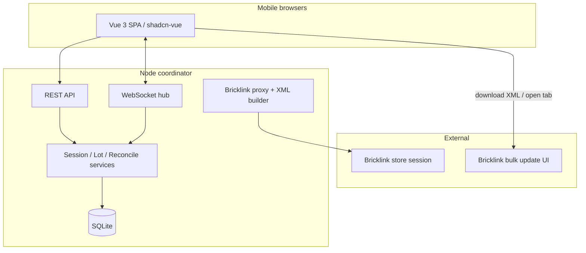

# Tech Spec — Part-Out Counting Coordinator

**AIDLC phase:** Design  
**Grounding:** Implements [product-spec.md](./product-spec.md). Product Spec human checkbox is open — Dave invoked `/design` to proceed; **explicit Product approval still required before `/build`**.

---

## Overview

| Field | Value |
|-------|-------|
| **Feature** | Part-Out Counting Coordinator |
| **Parent issue** | [GitHub #2](https://github.com/dcvezzani/brick-counter-coordinator/issues/2) |
| **Product Spec** | [product-spec.md](./product-spec.md) |
| **Status** | Draft — awaiting human approval for build |
| **Author** | AIDLC `/design` (David Vezzani, product owner) |
| **Created** | 2026-06-10 |
| **Last updated** | 2026-06-10 |

### Summary

A **Vue 3 SPA** (shadcn-vue, JavaScript) talks to a **Node.js coordinator** over **REST + WebSockets**. The server owns session state, lot consolidation, reconciliation, pick-list split, and Bricklink-oriented import/export. Work ships in **five Units** (0–4); each Unit gets a **child GitHub issue** on board [#2](https://github.com/users/dcvezzani/projects/2) for Build/Review cycles.

### Units

| Unit | Title | GitHub card (create) | Product criteria |
|------|-------|----------------------|------------------|
| **0** | Storyboard prototype | `Unit 0: Storyboard — all views` | #14, #15 |
| **1** | Shell & live session | `Unit 1: Session create/join` | #4 (partial), #14 |
| **2** | Counting & cups | `Unit 2: Lot entry + List cups` | #1–#7, #14 |
| **3** | Organizer pick lists | `Unit 3: List lots organizer` | #10–#12 |
| **4** | Reconciliation & XML export | `Unit 4: Part-out reconciliation` | #8, #9, #13 |

Units **1–4** depend on prior units only sequentially (2 needs 1, 3 needs 2, 4 needs 3). **Unit 0** has no server dependency.

---

## Context

### Existing system & documentation

| Source | Use |
|--------|-----|
| [docs/tech-stack.md](../../docs/tech-stack.md) | Client stack (Vite, shadcn-vue, JS) |
| [dcv/application-views.md](../../dcv/application-views.md) | View names, navigation |
| [dcv/storyboard.md](../../dcv/storyboard.md) | Unit 0 walkthrough |
| [PROJECT.md](../../PROJECT.md) | Bricklink extension module map |
| `src/` | Vite scaffold (`router`, `button` component) |

### ADRs (this Feature)

| ADR | Decision |
|-----|----------|
| [adr/0001-sqlite-single-node-persistence.md](../../adr/0001-sqlite-single-node-persistence.md) | SQLite file DB, single Node process |
| [adr/0002-bricklink-ajax-only-no-iframes.md](../../adr/0002-bricklink-ajax-only-no-iframes.md) | AJAX/fetch only for Bricklink |
| [adr/0003-part-out-import-json-upload-mvp.md](../../adr/0003-part-out-import-json-upload-mvp.md) | Part-out JSON upload for MVP import |

### Out of scope (entire Feature — unchanged from Product Spec)

Live Bricklink API submit, user accounts, native apps, multi-tenant SaaS, iframe Bricklink flows.

---

## Architecture

### High-level design



- **Thin client:** validation for UX only; authoritative rules on server.
- **Real-time:** WebSocket broadcasts lot/session changes to joined clients (near-real-time totals, duplicate awareness).
- **Bricklink:** Server holds **store session cookie** (env/config) for `list.ajax` and catalog color fetch; **no iframes** ([ADR-0002](../../adr/0002-bricklink-ajax-only-no-iframes.md)).
- **Part-out official list (MVP):** JSON file upload from extension scrape ([ADR-0003](../../adr/0003-part-out-import-json-upload-mvp.md)); server-side scrape deferred.

### Repository layout (target)

```
brick-counter-coordinator/
  src/                    # Vue client (existing)
    views/                # One SFC per application view
    components/           # Feature components + ui/ (shadcn)
    composables/          # useSession, useLots, useFixture (Unit 0)
    api/                  # REST client
    fixtures/             # Unit 0 mock session
    router/index.js
  server/                 # Node coordinator (new in Unit 1)
    index.js              # HTTP + WS listen
    app.js                # Express/Fastify app
    db/                   # SQLite schema, migrations
    routes/
    ws/
    services/
    bricklink/            # list.ajax proxy, colors, xml export
  package.json            # scripts: dev, dev:server, dev:all
```

**Dev:** `npm run dev` proxies `/api` and `/ws` to the coordinator (Vite `server.proxy`).

### Session lifecycle (server state machine)

| Phase | Who acts | UI views |
|-------|----------|----------|
| `counting` | Counters, lead | Home, New session, Lot form, List cups |
| `reconciling` | Lead, workers resolve | Part-out reconciliation |
| `organizing` | Organizers | List lots (organizer mode) |
| `closed` | — | Read-only or redirect Home |

Lead advances phase via API (`POST /sessions/:id/phase`).

---

## Data

SQLite schema (logical entities):

### `sessions`

| Column | Type | Notes |
|--------|------|-------|
| `id` | TEXT PK | UUID |
| `set_number` | TEXT | e.g. `70404-1` |
| `name` | TEXT | Display label |
| `phase` | TEXT | `counting` \| `reconciling` \| `organizing` \| `closed` |
| `part_out_options` | JSON | Pricing, N/U, overwrite vs consolidate |
| `created_at` | TEXT | ISO8601 |

### `workers`

| Column | Type | Notes |
|--------|------|-------|
| `id` | TEXT PK | UUID |
| `session_id` | TEXT FK | |
| `display_name` | TEXT | From Home join |
| `joined_at` | TEXT | |

Unique: `(session_id, display_name)`.

### `part_out_lines` (imported official list)

| Column | Type | Notes |
|--------|------|-------|
| `id` | TEXT PK | |
| `session_id` | TEXT FK | |
| `part_id` | TEXT | |
| `color_id` | INTEGER | Bricklink color id |
| `condition` | TEXT | `N` \| `U` |
| `qty_expected` | INTEGER | From part-out |
| `remarks` | TEXT | Storage location |
| `bricklink_lot_id` | TEXT | Nullable; for bulk-update XML |

### `lots` (counted session lots)

| Column | Type | Notes |
|--------|------|-------|
| `id` | TEXT PK | |
| `session_id` | TEXT FK | |
| `part_id` | TEXT | |
| `color_id` | INTEGER | |
| `condition` | TEXT | |
| `qty` | INTEGER | Consolidated count |
| `cup_id` | TEXT FK | Nullable |
| `created_by_worker_id` | TEXT FK | |
| `updated_at` | TEXT | |

Unique key: `(session_id, part_id, color_id, condition)`.

### `cups`

| Column | Type | Notes |
|--------|------|-------|
| `id` | TEXT PK | |
| `session_id` | TEXT FK | |
| `label` | TEXT | Optional display |

### `pick_list_items` (Unit 3)

| Column | Type | Notes |
|--------|------|-------|
| `id` | TEXT PK | |
| `session_id` | TEXT FK | |
| `worker_id` | TEXT FK | Assigned organizer |
| `lot_id` | TEXT FK | |
| `sort_key` | TEXT | Part id for ordering |
| `status` | TEXT | `pending` \| `moved_to_storage` \| `needs_new_location` |
| `list_complete` | INTEGER | Worker-level flag on last item |

### `reconciliation_overrides` (Unit 4)

Adjustments when resolving discrepancies (delta qty or agreed final qty per part-out line).

**Retention:** Session data kept until lead closes session; no cross-session inventory (MVP).

---

## APIs & contracts

Base path: `/api/v1`. JSON bodies. Errors: `{ "error": { "code": "...", "message": "..." } }`.

### Sessions (Unit 1+)

| Method | Path | Purpose |
|--------|------|---------|
| `GET` | `/sessions` | List open sessions (enter existing) |
| `POST` | `/sessions` | Create session (set number, options, lead name) |
| `GET` | `/sessions/:id` | Session detail + phase |
| `POST` | `/sessions/:id/join` | Body: `{ displayName }` → worker |
| `POST` | `/sessions/:id/phase` | Lead: advance phase |

### Part-out import (Unit 4; upload can stub in Unit 1)

| Method | Path | Purpose |
|--------|------|---------|
| `POST` | `/sessions/:id/part-out` | Multipart JSON file (extension scrape format) |

### Lots & cups (Unit 2)

| Method | Path | Purpose |
|--------|------|---------|
| `GET` | `/sessions/:id/lots` | Query: `cupId`, `workerId`, `mode` |
| `POST` | `/sessions/:id/lots` | Create/update lot; returns duplicate info if exists |
| `GET` | `/sessions/:id/cups` | All cups with lot counts |
| `POST` | `/sessions/:id/cups` | Create cup (optional MVP auto-cup per save) |

**Create lot response** when duplicate:

```json
{
  "lot": { "id": "...", "qty": 12, ... },
  "duplicate": true,
  "existing": { "createdBy": "Alex", "qty": 8 }
}
```

### Bricklink helpers (Unit 2+)

| Method | Path | Purpose |
|--------|------|---------|
| `GET` | `/bricklink/inventory-search?q=` | Proxy `list.ajax` (part search) |
| `GET` | `/bricklink/parts/:partId/colors` | Known colors (catalog or static JSON) |

### Reconciliation (Unit 4)

| Method | Path | Purpose |
|--------|------|---------|
| `GET` | `/sessions/:id/reconciliation` | Match/mismatch rows |
| `POST` | `/sessions/:id/reconciliation/resolve` | Apply resolution |
| `POST` | `/sessions/:id/reconciliation/export-xml` | Returns XML + validation URL |

XML shape: port `bricklink-chrome-extension/scripts/bulk-repair/lib/build-bulk-update-xml.mjs` (`<INVENTORY><ITEM><LOTID/><REMARKS/></ITEM>`). **Not** upload XML from `inv-upload-xml.js`. See [PROJECT.md](../../PROJECT.md#design-reference--bricklink-chrome-extension).

### Pick lists (Unit 3)

| Method | Path | Purpose |
|--------|------|---------|
| `POST` | `/sessions/:id/pick-lists/split` | Even split among current workers |
| `PATCH` | `/sessions/:id/pick-lists/:itemId` | Update line status |
| `POST` | `/sessions/:id/pick-lists/complete` | Mark worker list complete |

### WebSocket

Connect: `ws://host/ws?sessionId=&workerId=`

| Event | Payload | When |
|-------|---------|------|
| `lot.updated` | `{ lot }` | Save lot |
| `worker.joined` | `{ worker }` | Join session |
| `session.phase` | `{ phase }` | Phase change |
| `pick_list.updated` | `{ item }` | Organizer status |

**Reconnect:** Client refetches `GET /sessions/:id` and lots on open; server does not replay full history (MVP).

**Offline / dropped connection:** Client queues failed `POST` in `sessionStorage` with retry banner (max 1 retry UI); server idempotency via lot unique key on upsert.

---

## UI / client

### Routes (Vue Router)

| Path | View | Unit |
|------|------|------|
| `/` | Home | 0 |
| `/session/new` | New session | 0 |
| `/sessions` | Enter existing (modal or sub-view on Home) | 0 |
| `/session/:sessionId/cups` | List cups | 0 |
| `/session/:sessionId/lot/:lotId?` | Lot form (`lotId` optional = new) | 0 |
| `/session/:sessionId/lots` | List lots — query `mode=organizer\|cup\|reconciliation`, `cupId` | 0 |
| `/session/:sessionId/reconciliation` | Part-out reconciliation | 0 |

**Layout:** `AppShell` with session nav links, **“Storyboard — sample data”** badge (Unit 0 only), mobile bottom nav.

### Shared components

| Component | Purpose |
|-----------|---------|
| `LotListTable` | Shared list UI for three List lots modes |
| `LotForm` | Part search, color swatches, condition, count, Save / Save and Add Another |
| `ColorPicker` | Port UX from extension `catalog-known-colors` + `bricklink-colors.json` |
| `PartSearchCombobox` | Debounced search → `/bricklink/inventory-search` |
| `SessionNav` | Links to all views |

### shadcn-vue components (install per view)

`button`, `card`, `input`, `label`, `form`, `select`, `radio-group`, `checkbox`, `table`, `badge`, `alert`, `dialog`, `sheet` (mobile nav). Avoid `chart`, `sidebar` registry blocks in JS mode.

### Unit 0: fixture layer

- `src/fixtures/demo-session.js` — data from [dcv/storyboard.md](../../dcv/storyboard.md)
- `composables/useFixtureSession.js` — in-memory mutations for walkthrough
- `composables/useSession.js` — swaps fixture vs API by `import.meta.env.VITE_USE_FIXTURES` (default `true` until Unit 1)

### Mobile

- Tailwind: single-column, `min-h-dvh`, form controls visible at `max-width: 390px` without scroll on Lot form (Product #3).
- Touch targets ≥ 44px.

---

## Security & privacy

| Topic | MVP approach |
|-------|----------------|
| Auth | None; display name only |
| Bricklink cookie | Server env `BRICKLINK_SESSION_COOKIE` — never sent to browser |
| CSRF | Same-origin SPA; cookie `HttpOnly` if added later |
| Input validation | Server validates part ids, qty ≥ 0, enum condition |
| PII | Display names only; no email |

Local-network deployment assumed; document in README for production hardening later.

---

## Unit specifications

### Unit 0 — Storyboard

**Deliver:** All routes + fixture-backed views; no `server/`.

**Acceptance (Review):**

- [ ] All six views reachable per [dcv/storyboard.md](../../dcv/storyboard.md)
- [ ] Storyboard badge visible; no API calls
- [ ] Lot form fits mobile viewport without scroll
- [ ] List lots supports `mode` query switching (organizer / cup / reconciliation UI)
- [ ] Playwright smoke: Home → New session → List cups → Lot form

**Tests:** Vitest for composables; Playwright happy-path walkthrough.

---

### Unit 1 — Shell & live session

**Deliver:** `server/` scaffold, SQLite migrations, session CRUD + join; Home + New session wired to API; other views still fixture or read-only shell.

**Acceptance:**

- [ ] `POST /sessions` creates session; worker stored
- [ ] `GET /sessions` lists open sessions
- [ ] Join with display name; duplicate name rejected or suffixed (document behavior)
- [ ] WebSocket connects on enter session
- [ ] `npm run dev:all` runs client + server

---

### Unit 2 — Counting

**Deliver:** Lots, cups, WebSocket updates, part search proxy, color picker, duplicate-lot messaging.

**Acceptance:**

- [ ] Product criteria #1, #2, #5, #6, #7
- [ ] Two browsers: parallel lot entry without overwrite
- [ ] Save and Add Another pre-fills part id
- [ ] List cups branching (one vs many lots)

**Tests:** API integration tests for lot unique constraint; Playwright two-context parallel test.

---

### Unit 3 — Organizer lists

**Deliver:** Pick-list split, line statuses, print stylesheet, list-complete.

**Acceptance:**

- [ ] Product criteria #10–#12
- [ ] Even split algorithm: round-robin by sorted part id; no worker gets 0 lines when N ≥ M
- [ ] `window.print()` or print CSS for List lots
- [ ] Status persists across refresh

---

### Unit 4 — Reconciliation & export

**Deliver:** Part-out JSON upload, reconciliation report, resolve, XML export.

**Acceptance:**

- [ ] Product criteria #8, #9, #13
- [ ] Mismatch filter on reconciliation list
- [ ] XML validates on Bricklink bulk update validation page (manual sign-off)
- [ ] Reconciled opens download + link to bulk update UI

**Part-out JSON schema:** Align with extension `code-scraper.js` output; document in `server/bricklink/part-out-schema.json`.

---

## Testing approach

| Layer | What we prove |
|-------|----------------|
| **Unit** | Split algorithm, reconciliation diff, XML builder, `cn`/composables |
| **Integration** | API routes against SQLite in-memory or temp file |
| **E2E** | Playwright: storyboard path (Unit 0); two-device counting (Unit 2) |
| **Manual** | Bricklink XML validation; mobile viewport Lot form; storyboard walkthrough with staff |

CI (add in Unit 1): `npm run test:unit`, `npm run build`, optional `test:e2e` on PR.

---

## Rollout & operations

### Rollout

1. Unit 0 → stakeholder review → Product Spec tweaks
2. Units 1–4 sequential PRs; each child issue on Projects board
3. Single-machine deploy: Node serves `dist/` + API (Docker optional later)

### Monitoring (MVP)

- Console structured logs (session id, route, errors)
- Health: `GET /api/v1/health`

### Rollback

- Revert PR; SQLite migrations backward-compatible within Feature
- Feature flag `VITE_USE_FIXTURES` to fall back to storyboard-only client

---

## Design review passes

### Architecture

- Boundaries: client / API / WS / DB / Bricklink proxy — **pass**
- Single Node + SQLite appropriate for single-business MVP ([ADR-0001](../../adr/0001-sqlite-single-node-persistence.md))
- No iframe Bricklink — **pass** ([ADR-0002](../../adr/0002-bricklink-ajax-only-no-iframes.md))

### Frontend (`frontend-web`)

- Mobile-first, shared `LotListTable`, fixture swap via composable — **pass**
- shadcn-vue JS mode; avoid problematic registry components — **pass**

### Backend (`backend-saas`)

- REST versioning, explicit error model, server-side session authority — **pass**
- Bricklink cookie server-only — **pass**

### Testing

- Criteria mapped per Unit; Playwright for storyboard and parallel counting — **pass**

### DevOps

- No deploy workflow yet; add `ci.yml` in Unit 1 with build + unit tests — **action item**

---

## Risks & open technical questions

| Risk / question | Mitigation / owner |
|-----------------|---------------------|
| Bricklink session cookie rotation | Document refresh procedure; env var update |
| Part-out JSON schema drift vs extension | Shared schema file; Dave validates sample export |
| Server-side part-out fetch wanted later | ADR-0003 defers; add ADR when prioritizing |
| `list.ajax` rate limits | Debounce search; cache colors per part id |
| SQLite write contention | Single session MVP load is low; revisit if needed |
| Product Spec not formally checked | Dave: check approval box before `/build` |

### Change requests to Product

None. **Design choice recorded:** part-out import via JSON upload for MVP (ADR-0003) — aligns with extension scrape path Dave already has.

---

## Change history

| Date | Author | Changes |
|------|--------|---------|
| 2026-06-10 | `/design` | Initial Tech Spec: architecture, data model, APIs, Units 0–4, review passes |

## Human approval

- [ ] Product owner approved Product Spec
- [ ] Engineering lead / Dave approved Tech Spec before `/build`
